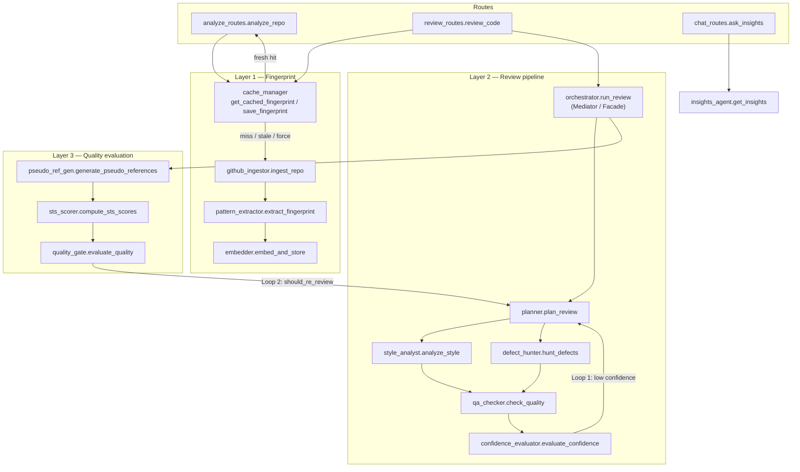

# PersonaCR — Architecture

Documentation of structural design patterns already present in the codebase. This describes how the system is organized — not measured product outcomes. Personalization effectiveness is under active measurement and is not claimed here.

---

## Component overview

---

## Design patterns in code

### Mediator / Facade — Orchestrator

`backend/src/agents/orchestrator.py` (`run_review`, `review_code_sync`) is the single coordination surface for a review: it sequences agents, runs Style Analyst and Defect Hunter via `asyncio.gather`, builds `ReviewResult`, and owns both agentic loops. Callers (`review_routes.review_code`) do not wire agents directly.

### Strategy — Per-agent modules

Each review agent is an interchangeable strategy behind a narrow entry function and typed output from `backend/src/core/models.py`:

| Strategy | Module | Entry |
|----------|--------|--------|
| Plan focus / depth | `planner.py` | `plan_review` → `PlannerOutput` |
| Style vs fingerprint | `style_analyst.py` | `analyze_style` → `StyleAnalysisOutput` |
| Bugs / smells / security | `defect_hunter.py` | `hunt_defects` → `DefectHunterOutput` |
| Filter findings | `qa_checker.py` | `check_quality` → `QACheckerOutput` |
| Score confidence | `confidence_evaluator.py` | `evaluate_confidence` → `ConfidenceOutput` |

`insights_agent.get_insights` is a separate conversational strategy invoked from `chat_routes`, not from the review pipeline.

### Chain of Responsibility / Pipeline — Layer 2 (+ Layer 3)

The review path is a fixed pipeline in `run_review`:

1. `plan_review`
2. `analyze_style` ‖ `hunt_defects` (parallel)
3. `check_quality` → `evaluate_confidence`
4. Layer 3: `generate_pseudo_references` → `compute_sts_scores` → `evaluate_quality`

Each stage consumes the prior stage’s outputs (or shared inputs like `code` / `fingerprint`) and hands off along the chain. API docs in `review_routes` describe this as the multi-agent review pipeline.

### Observer — Metrics / traces

During `run_review`, every stage appends an `AgentTrace` (`backend/src/core/models.py`) into a `traces` list — agent name, input/output summaries, decision text, `execution_time_ms`, and iteration. That list is returned on `ReviewResult.agent_trace` without agents needing to know about dashboards or analytics consumers. Related aggregate fields (e.g. `AnalyticsResponse.confidence_loop_rate`) sit on the same metrics surface.

### Cache-Aside — SHA-based fingerprint cache

`backend/src/core/cache_manager.py` implements cache-aside for fingerprints:

- `analyze_routes.analyze_repo` and `review_routes.review_code` call `get_cached_fingerprint` first.
- On a fresh hit (cached `last_commit_sha` matches GitHub HEAD via `_get_latest_sha`), analysis is skipped and the stored `fingerprint_data` is used.
- On miss / stale / `force_refresh`, the route runs `ingest_repo` → `extract_fingerprint` → `embed_and_store`, then `save_fingerprint` upserts Supabase with the new SHA.

### Feedback / Retry — Two agentic loops

Both loops live in `orchestrator.run_review` (default `max_iterations=2`):

| Loop | Trigger | Behavior |
|------|---------|----------|
| **Loop 1 — Confidence** | `ConfidenceOutput.is_confident` is false and iterations remain | `while` restarts Layer 2 from `plan_review` |
| **Loop 2 — Quality gate** | After Layer 3, `QualityGateResult.should_re_review` and iterations remain | Re-runs Layer 2 with `_quality_feedback` / `_previous_focus` on an enriched fingerprint dict, then re-evaluates Layer 3 |

Loop 1 is driven by `confidence_evaluator.evaluate_confidence`; Loop 2 by `evaluation.quality_gate.evaluate_quality`.

---

## Supporting modules (not pattern foci)

| Concern | Primary modules |
|---------|-----------------|
| Fingerprint schema | `core/models.py` → `FingerprintData` |
| Ingestion | `core/github_ingestor.py` |
| Embeddings / retrieval | `core/embedder.py` (`query_similar_staged` used by Style Analyst) |
| Persistence | `db/supabase_rest.py` |
| HTTP entry | `routes/analyze_routes.py`, `review_routes.py`, `chat_routes.py` |
| Async review processing via Redis-backed job queue | `core/review_queue.py`, `core/job_store.py`, `workers/` (RQ, single-worker local/dev) |

---

## Honesty note

This document names structure only. It does not assert that fingerprint-conditioned review outperforms a generic baseline; that thesis remains unproven / under measurement in the eval suite.
