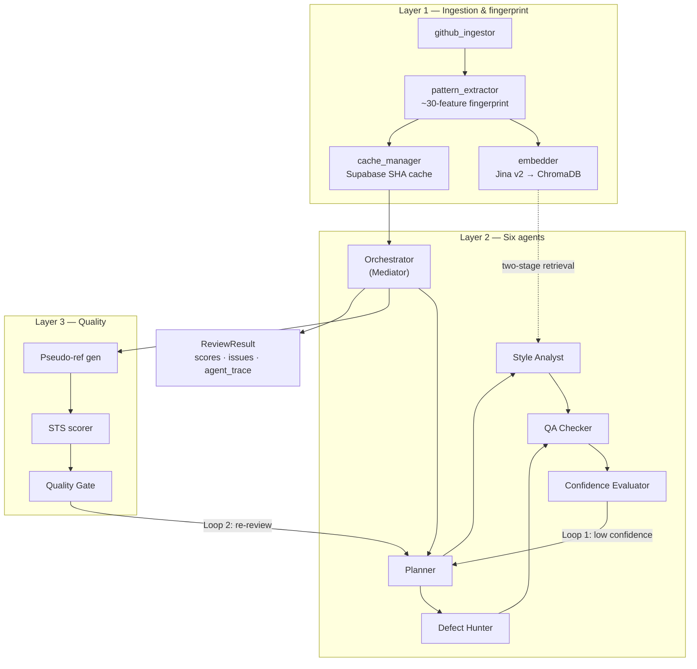

# PersonaCR

**Personalized multi-agent code review** — learns a codebase’s style conventions from GitHub (AST fingerprint + retrieval), then reviews new code against those patterns rather than only generic rules.

This README is a design document. It describes architecture, research grounding, and measured evaluation. It does **not** claim that personalization outperforms generic review.

---

## Overview / Motivation

Most automated reviewers (linters, LLM PR bots) score code against universal “best practices.” Teams and long-lived libraries often encode different norms: sparse docstrings, high type-hint usage, rare `try/except`, snake_case naming, and so on. Flagging the absence of a rare practice as a defect is noise; missing a real departure from the repo’s norms is a miss.

PersonaCR tests a concrete hypothesis: if you extract a quantitative **coding fingerprint** from a repository and condition a multi-agent review on that fingerprint (plus similar retrieved functions), the review should track objective style deviations better than the same pipeline with an empty fingerprint.

That hypothesis is **under measurement**. At the current fair-metric sample (N=14 paired-clean cases against `psf/requests`), the personalized-vs-generic comparison is **inconclusive** — directional only, not a demonstrated win. See [Evaluation & Honest Findings](#evaluation--honest-findings).

---

## System Architecture

PersonaCR is organized in three layers: fingerprinting (Layer 1), multi-agent review (Layer 2), and CRScore-inspired quality evaluation (Layer 3). Coordination and patterns follow [ARCHITECTURE.md](ARCHITECTURE.md).



### Data flow (narrative)

1. **Repo → chunks** — PyGithub ingestion yields file/function `CodeChunk`s.
2. **Chunks → fingerprint** — AST/`pattern_extractor` builds a ~30-feature profile (rates, naming, density stats).
3. **Chunks → vectors** — Jina code embeddings stored in ChromaDB at file and function granularity.
4. **Snippet → review** — Orchestrator loads the cached fingerprint, plans focus, runs Style Analyst (two-stage retrieval + LLM) in parallel with Defect Hunter (AST + LLM), then QA and confidence scoring.
5. **Self-check** — Layer 3 builds pseudo-references, scores review text with MiniLM STS, and may trigger a second review pass.

### Design patterns (in code)

| Pattern | Where | Role |
|--------|--------|------|
| **Mediator / Facade** | `orchestrator.run_review` | Single coordination surface; callers do not wire agents |
| **Strategy** | Per-agent modules (`planner`, `style_analyst`, …) | Narrow entry + typed outputs |
| **Chain of Responsibility / Pipeline** | Layer 2 → Layer 3 sequence | Fixed handoff of stage outputs |
| **Observer** | `AgentTrace` list on `ReviewResult` | Stages append traces without knowing consumers |
| **Cache-Aside** | `cache_manager` + Supabase | SHA match → reuse fingerprint; else ingest → extract → embed → save |
| **Feedback / Retry** | Two agentic loops in the orchestrator | Confidence re-plan; quality-gate re-review (max 2 iterations default) |

Redis/RQ async review jobs and Prometheus `/metrics` + Grafana **run and are verified via local Docker Compose** (dev/portfolio scale — not a production HA or multi-node claim). See [ARCHITECTURE.md](ARCHITECTURE.md).

---

## Tech Stack

| Area | Stack |
|------|--------|
| **Backend** | Python, FastAPI, Uvicorn, PyGithub, ChromaDB, Supabase (REST), Redis/RQ (optional async queue), Groq Llama 3.3 70B (`llama-3.3-70b-versatile`), Jina v2 code embeddings via fastembed, sentence-transformers (`all-MiniLM-L6-v2`) for STS |
| **Frontend** | React 19, TypeScript, Vite, Zustand, Tailwind CSS v4, Recharts, Framer Motion, Supabase Auth |
| **Infra / ops** | GitHub Actions CI (Python **3.12**, Node **24**), Docker Compose for Redis + Prometheus + Grafana, MCP via `fastapi-mcp` (MCP package pinned to **1.x**) |

---

## How It Works

### Fingerprinting (~30 features)

`pattern_extractor.extract_fingerprint` aggregates per-function AST signals into a profile, including:

- Length / complexity (`avg_function_length`, `avg_complexity`, …)
- Convention rates (`docstring_coverage`, `type_hint_usage`, `error_handling_rate`, `naming_convention`)
- Style / density (comments, conditionals, loops, `comprehension_ratio`, indentation, line-length stats, imports)

Feature engineering draws on the Ghaleb et al. fingerprinting methodology (subset adapted for developer style). Full mapping: [research/RELATED_WORK.md](research/RELATED_WORK.md).

### Two-stage retrieval

Following multi-granularity fingerprinting practice (Ringer et al. in repo notes): embeddings are stored with `granularity` = file or function. `query_similar_staged()` retrieves relevant files first, then functions within those files, so the Style Analyst sees both context and close matches.

### Six agents

| Agent | Role |
|-------|------|
| **Planner** | Hybrid rules fast path + LLM fallback; chooses focus / depth |
| **Style Analyst** | Compares submission to fingerprint + retrieved peers; post-filters direction / non-deviations |
| **Defect Hunter** | Local AST checks + LLM semantic defects |
| **QA Checker** | Filters irrelevant / hallucinated findings |
| **Confidence Evaluator** | Rules-based score; Loop 1 if below threshold (0.7) |
| **Orchestrator** | Mediates pipeline, `asyncio.gather` for Style ‖ Defect, owns loops |

### Two self-correction loops

1. **Loop 1 (confidence)** — If not confident and iterations remain, restart Layer 2 from planning.
2. **Loop 2 (quality gate)** — After Layer 3, if `should_re_review`, re-run Layer 2 (+ Layer 3) with quality feedback (capped iterations).

### CRScore-style evaluation (Layer 3)

Pseudo-references (AST + LLM) → pairwise STS with MiniLM → comprehensiveness / conciseness / relevance → rules-based quality gate. Inspired by CRScore (Naik et al.); used as an in-pipeline quality signal, not as the personalization thesis metric.

---

## Research Grounding

Papers below are taken from [research/RELATED_WORK.md](research/RELATED_WORK.md). Links are as listed there; see also the [unverified / pending](#citations--facts-pending-manual-verification) list at the end of this README.

| Paper (as in RELATED_WORK) | Informs |
|----------------------------|---------|
| CodeAgent (Tang et al., EMNLP 2024) — [arXiv:2402.02172](https://arxiv.org/abs/2402.02172) | Multi-agent roles; QA-Checker idea |
| CRScore (Naik/Alenius/Fried/Rose, arXiv 2024) — [arXiv:2409.19801](https://arxiv.org/abs/2409.19801) | Pseudo-refs, STS dims, Layer 3 |
| MPCODER (Dai et al., ACL 2024) — [arXiv:2406.17255](https://arxiv.org/abs/2406.17255) | Per-developer style as a learnable signal (generation → we apply to **review**) |
| RevAgent (Li et al.) — [arXiv:2511.00517](https://arxiv.org/abs/2511.00517) | Parallel category agents + critic-like filter |
| Latency-Aware Multi-Agent Architecture Search — [arXiv:2601.10560](https://arxiv.org/abs/2601.10560) | Critical-path thinking; hybrid planner; capped loops; parallel independent agents |
| Multi-Agent Design (Google Research) — [arXiv:2502.02533](https://arxiv.org/abs/2502.02533) | Centralized orchestrator topology; orchestration over raw model size |
| AI Agent Fingerprinting (Ghaleb et al., MSR 2026) — [arXiv:2601.17406](https://arxiv.org/abs/2601.17406) | Feature set for code fingerprinting (repurposed for human/repo style) |
| Multi-Granularity Code Fingerprinting (Ringer et al., 2025) — [DOI 10.1016/j.csi.2025.103973](https://doi.org/10.1016/j.csi.2025.103973) | File + function Chroma storage; two-stage retrieval |
| Ericsson LLM + Static Analysis — [arXiv:2507.19115](https://arxiv.org/abs/2507.19115) | LLM + static analysis pairing; industry interest in personalization |

---

## Novelty

**Approach (what is new here):** combining **cold-start AST fingerprint** style learning with a **multi-agent review** pipeline (retrieval-conditioned Style Analyst, parallel Defect Hunter, QA, confidence/quality loops). RELATED_WORK frames the literature gap as: personalized *generation* exists (e.g. MPCODER); multi-agent *review* exists (e.g. CodeAgent, RevAgent); **published work combining both for review is not identified** in that survey.

**What is not claimed:** that this approach **beats** generic review in production or on a large benchmark. The fair-metric result at N=14 is **inconclusive**. Novelty here means a **novel approach rigorously tested**, not a proven performance win.

Commercial tools (e.g. CodeRabbit-class PR reviewers) are typically framed in project notes as reviewing against **generic** standards. Repo notes do **not** document Greptile/Kodus internals (e.g. PR-comment history vs AST cold-start); those comparisons are omitted rather than invented.

---

## Evaluation & Honest Findings

Primary write-up: [evals/minimal_a_result.md](evals/minimal_a_result.md). Framing: [evals/shared_scale_framing.md](evals/shared_scale_framing.md).

### Fair shared-scale metric

Findings-derived `style_score` alone was a poor thesis metric: the generic arm (empty fingerprint) is instructed not to emit personal-pattern findings, which can collapse separation (**circularity** risk). The frozen **framing-(a)** metric instead:

1. Computes **feature-distance** between submitted code and the requests fingerprint (same formula for both arms).
2. Asks whether each arm’s Style Analyst findings **mention true material deviations** (OFF recall) without inventing deviations on in-style code (IN false-positive rate).

Weights were locked before re-measure (equal weights on five axes). Thresholds were not tuned to force a win.

### Measurement bugs caught and fixed (rigor story)

| Issue | What went wrong | Fix direction |
|-------|-----------------|---------------|
| Finding-count / flat signal | Counts saturated or hid control separation | Prefer score / shared-scale tracking over raw counts |
| Circular generic `style_score` | Empty-FP arm emits few personal findings → artificial sep | Stop using findings-score as sole personalized-vs-generic separator |
| Scorer Defect A | LLM free-form `overall_style_score` ignored findings | Score = f(findings) with severity penalties |
| Scorer Defect B | Findings inverted fingerprint direction (e.g. “missing docstring” when rare) | Direction filter + later paraphrase / non-deviation suppress |
| IN over-flagging | Personalized IN FP-rate ~1.0 (praise, generic nits, paraphrases) | Widen Defect B; suppress praise/generic priors; allow empty findings |

Post-fix re-score (0 new Groq): IN FP-rate **1.0 → ~0.43**; personalized OFF recall **held at ~0.45**. Cleaner IN is a **bug fix side effect**, not a thesis retune.

### Result at N=14 (state plainly)

| Fact | Value |
|------|--------|
| Control / pairs | Feature-distance separates IN vs OFF: **7/7** pairs OFF farther (mean IN dist 0.08, OFF ~0.77) |
| Personalized OFF recall | ~**0.45** |
| Generic OFF recall | ~**0.14** |
| Personalized IN FP-rate (post-fix) | ~**0.43** |
| Generic IN FP-rate | ~**0.29** |
| Per-pair verdicts | personalized_better **2**/7; wrong-way **1**; rest mixed |
| **Fair-metric verdict** | **inconclusive** — directional only; **not** statistical significance; **does not** show personalization beats generic |

Reporting an inconclusive result after fixing metric and scorer bugs is intentional engineering judgment: prefer a fair null over a rigged win.

---

## Running Locally

### Prerequisites

- **Python:** CI and smoke use **3.12**. Local **3.14** can work (fastembed/ONNX path); prefer 3.12 for parity with CI.
- **Node:** **24** (aligned with CI) for the frontend.
- **Docker** (optional): only needed for Redis queue and/or Prometheus/Grafana via Compose (stack verified running locally).
- API keys: Groq + Supabase (see `.env` examples).

### Backend

From the **repository root**:

```bash
python -m venv .venv
# Windows: .venv\Scripts\activate
# Unix:    source .venv/bin/activate

pip install -r backend/requirements.txt
cp backend/.env.example backend/.env
# Edit backend/.env — at minimum GROQ_API_KEY, SUPABASE_URL, SUPABASE_ANON_KEY / SERVICE_ROLE as needed

uvicorn backend.src.main:app --reload --port 8000
```

OpenAPI: [http://localhost:8000/docs](http://localhost:8000/docs).

### Frontend

```bash
cd frontend
cp .env.example .env
# Set VITE_API_URL (default http://localhost:8000), VITE_SUPABASE_URL, VITE_SUPABASE_ANON_KEY

npm install
npm run dev
```

### Redis async queue (optional)

Requires Docker:

```bash
docker compose up -d redis
# From repo root, with backend deps + REDIS_URL set (see backend/.env.example):
python -m backend.src.workers.worker
```

Sync `POST /api/review` remains available without Redis. Async path: `POST /api/reviews` + `GET /api/reviews/{job_id}` (local Compose verified; local/dev scale).

### Observability (optional)

Local Compose stack verified end-to-end (Prometheus **9090**, Grafana **3001**):

```bash
docker compose up -d prometheus grafana
```

- Prometheus: [http://localhost:9090](http://localhost:9090)  
- Grafana: [http://localhost:3001](http://localhost:3001) (compose defaults; anonymous Viewer enabled in compose)  
- App metrics: `GET /metrics` on the API (dev/portfolio scale — not a production SRE claim).

### Tests

```bash
pip install pytest pytest-asyncio   # if not already installed
python -m pytest -m "not groq"
```

Excludes live Groq tests. Deterministic CI job runs the same marker set.

### MCP (optional)

With the API running, MCP is mounted at `/mcp` (`fastapi-mcp`). Example remote wiring lives under `backend/mcp_config_examples.json`.

---

## Known Limitations & Future Work

- **Sample size:** Fair personalization comparison at **N=14** paired-clean cases — directional only.
- **Thesis:** Personalized vs generic remains **inconclusive**; do not cite as a win.
- **Metric shape:** Shared scale uses a small frozen feature set + mention tracking; production UX still surfaces a scalar `style_score` / CRScore dims — not a full per-feature explanation vector for every claim.
- **Infra:** Redis/RQ and Prometheus/Grafana **run and are verified via local Docker Compose** (Redis **6379**, Prometheus **9090**, Grafana **3001**); still **not validated at multi-node / production scale**.
- **MCP:** Pinned to **mcp 1.x** / compatible `fastapi-mcp` (mcp 2.x broke the Server API in CI pins).
- **Frontend:** Core pages work; several UI hooks/components remain stubs (`useTheme`, `Card`, etc. in PROJECT_OVERVIEW) — refactor/cleanup pending.
- **Deps listed but unused in source:** e.g. ReportLab / pylint appear in requirements without call sites (see PROJECT_OVERVIEW).
- **Eval scope:** Minimal-A pairs are hand-authored against `psf/requests`; not a multi-repo industry benchmark.

---

## Project layout (high level)

```
backend/src/agents/      # Orchestrator + review agents
backend/src/core/        # Ingest, fingerprint, embedder, cache, queue
backend/src/evaluation/  # Pseudo-refs, STS, quality gate
backend/src/routes/      # FastAPI routes
frontend/                # React app
evals/                   # Minimal-A harness + honest result write-ups
research/RELATED_WORK.md # Paper → component map
ARCHITECTURE.md          # Patterns + component diagram
```

---

## Author

**Vaishnavi Chaughule** — MS Computer Science, Northeastern University (Seattle)

- GitHub: [vaishnavi1064](https://github.com/vaishnavi1064)
- LinkedIn: [Vaishnavi Chaughule](https://linkedin.com/in/vaishnavi-chaughule)

---

## Citations & facts pending manual verification

These appear in repo notes with links, but were **not** independently re-verified (author lists, venue pages, or DOIs) beyond what RELATED_WORK / PROJECT_OVERVIEW already state. Treat as **citation pending verification** if you need camera-ready bibliography quality:

| Item | Notes |
|------|--------|
| RevAgent (Li et al., Nov 2025) | arXiv:2511.00517 in RELATED_WORK; author list / venue not cross-checked outside that file |
| Latency-Aware MAS (Jan 2026) | arXiv:2601.10560; RELATED_WORK does not list named authors |
| Multi-Agent Design (Google Research, Feb 2025) | arXiv:2502.02533; author list not expanded in RELATED_WORK |
| Ghaleb et al. MSR 2026 | arXiv:2601.17406 + replication GitHub link in RELATED_WORK; MSR acceptance details not re-checked |
| Ringer et al. CSI 2025 | DOI present in RELATED_WORK; full author list not copied here |
| Ericsson experience report | arXiv:2507.19115; “IEEE (industry report)” per RELATED_WORK only |
| Greptile / Kodus vs PR-comment history | **Not supported** by repo notes — intentionally omitted from Novelty |
| Old README latency tables (~8.5s E2E, etc.) | **Not** carried forward — not re-verified for this design doc |

**Honesty check (results / novelty):** README states fingerprint control separation and **inconclusive** personalized-vs-generic at N=14 (2 personalized_better, 1 wrong-way, directional only). It does **not** claim personalization beats generic review.
