# PersonaCR

**Code review against your repo's own conventions.** PersonaCR reads a GitHub repo, measures how it is actually written (a ~30-feature style fingerprint), and reviews new code against that, with six cooperating agents, line-level findings, and an honest confidence signal.

[](https://github.com/vaishnavi1064/PersonaCR/actions/workflows/ci.yml)


**Live demo:** https://personacr.northcentralus.cloudapp.azure.com/

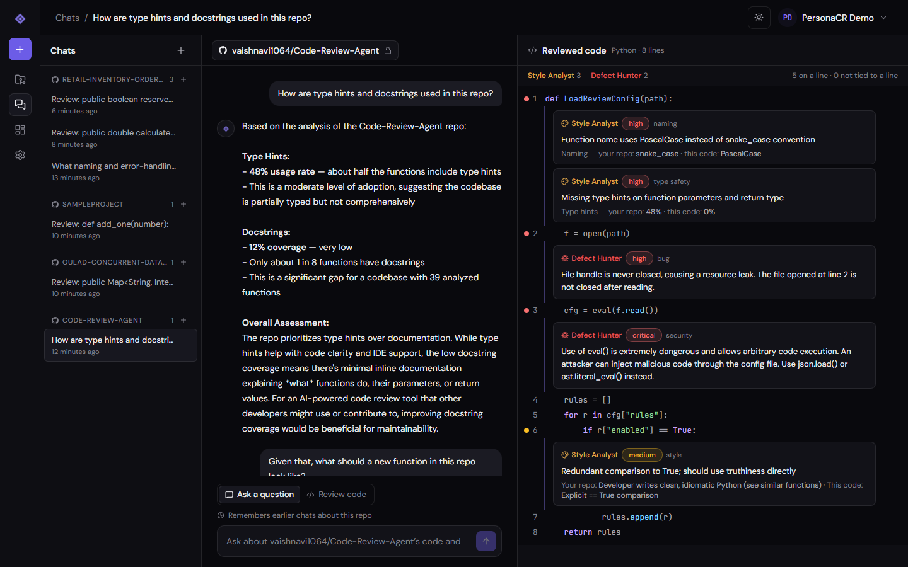
<sub>Real review of a function submitted against <code>vaishnavi1064/Code-Review-Agent</code>. Each finding sits under its line; style findings show the repo's value next to this code's ("Type hints: your repo 48% · this code 0%").</sub>

### What it does

- **Explain my repo.** Import a public GitHub repo; a background job measures its conventions (naming, type hints, docstrings, error handling, function size, comments, …) and writes a one-line summary.
- **Ask about my repo.** Chat with an agent grounded in that repo's fingerprint, its code and your earlier chats about the same repo, never other repos.
- **Review my code against my repo's style.** Paste code; six agents check style against the fingerprint plus similar functions from the repo, hunt defects (AST + LLM), filter their own findings, and report a score, a confidence level and a full agent trace.

### Built & verified vs. not yet

| Built & verified | Not yet / limitations |
|---|---|
| Full pipeline: import → background analysis → fingerprint + summary → Q&A with repo memory → review on a worker → line-level findings | **Personalization is not shown to beat generic review.** The fair benchmark at N=14 is *inconclusive* ([Evaluation](#evaluation)) |
| Auth on every `/api` route (Supabase JWT) + Postgres Row Level Security, verified against the live project | Confidence is a hand-weighted heuristic, not a calibrated probability |
| Async jobs on Redis/RQ with heartbeats, stale-job recovery and a build-aside vector index, verified on minikube with a worker crash | Runs locally / on single-node minikube only; no cloud deploy or HA |
| 272 backend tests, 87 frontend tests, CI (ruff, mypy, tsc, eslint, vitest, pytest) | Non-Python function extraction is regex-based; several fingerprint features are approximations ([details](#the-style-fingerprint)) |

---

## Screenshots

All screens are from a real run on a local minikube cluster: the app built from this repo, real Redis, the real Supabase project, Claude Haiku 4.5. The data belongs to a throwaway demo account that imported real public repos and ran real reviews. Dark mode unless noted.

| | |
|---|---|
| 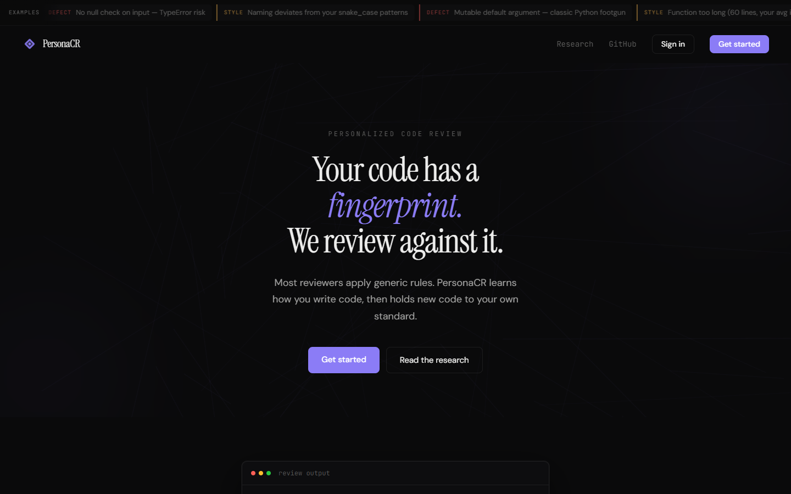<br><sub>**Landing page.** Static marketing page; the ticker and sample "review output" are illustrative copy, not a live review.</sub> | 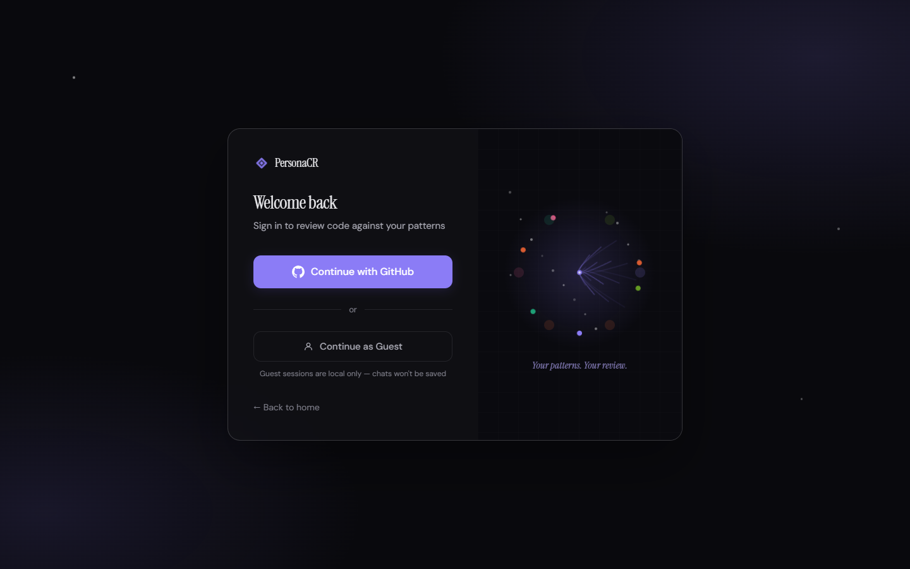<br><sub>**Login.** GitHub OAuth or "Continue as Guest" (Supabase anonymous sign-in, so guests carry a real token too).</sub> |
| 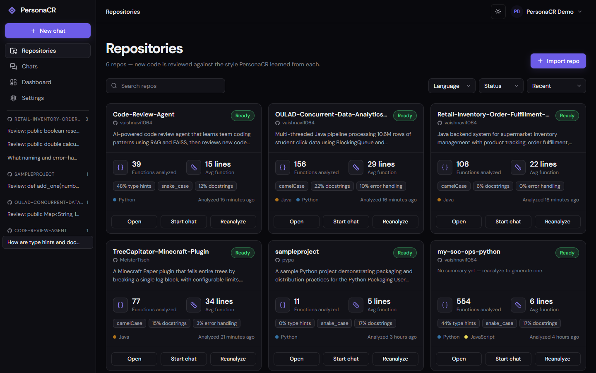<br><sub>**Repositories.** Six imported repos (Java, Python, mixed) with fingerprint chips and the generated one-line summaries.</sub> | 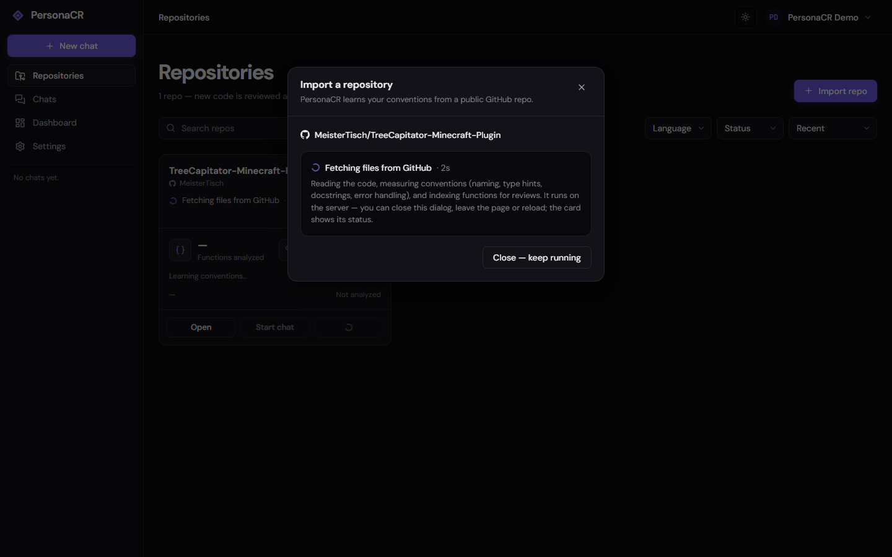<br><sub>**Import while analyzing.** The stage text ("Fetching files from GitHub · 2s") is the server's live job status, not an invented progress bar.</sub> |
| 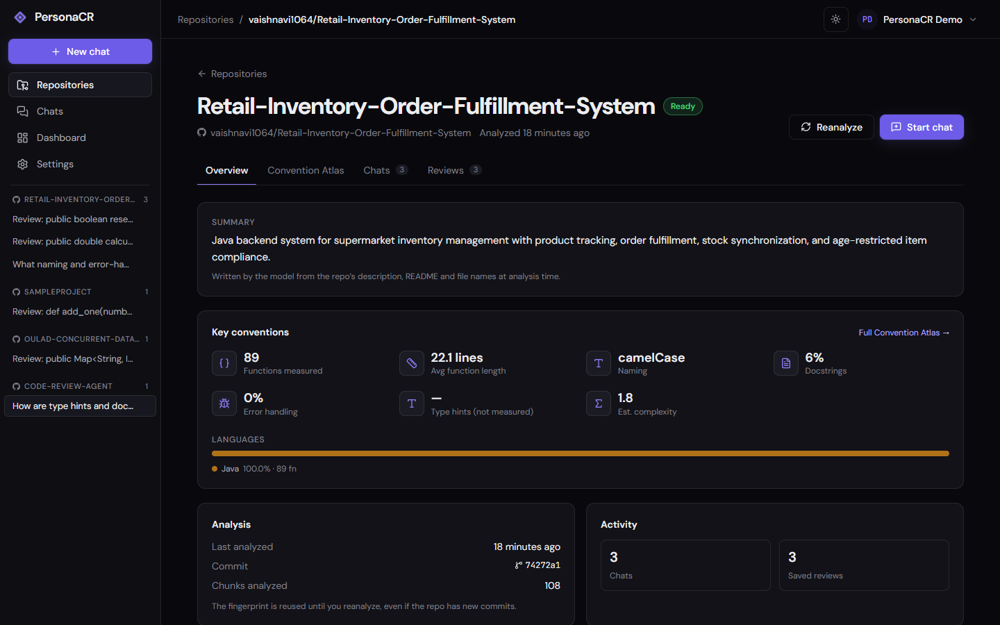<br><sub>**Repo detail: Overview.** Summary written at analysis time, key conventions, commit analyzed, chunk count, activity.</sub> | 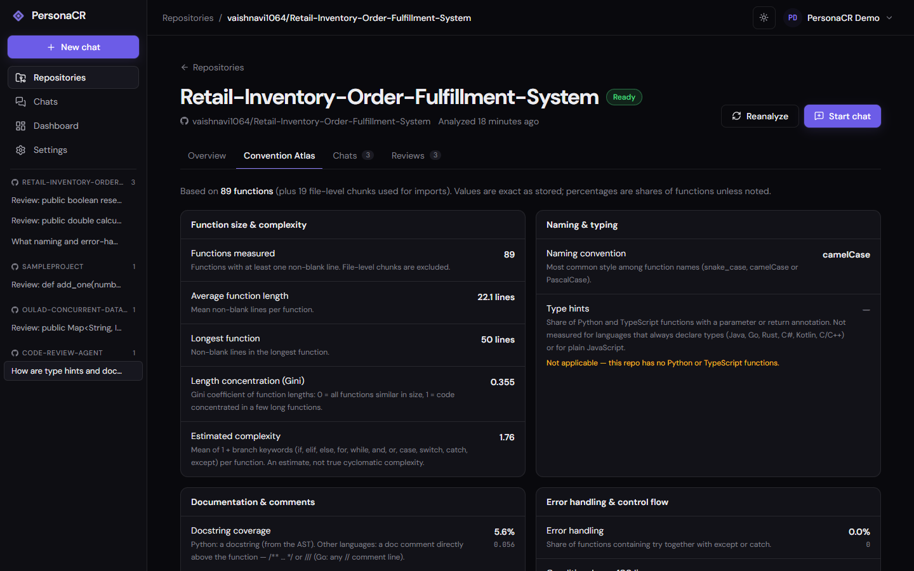<br><sub>**Convention Atlas.** Every measured feature with its definition. Type hints show "Not applicable" for a Java-only repo instead of a fake 100%.</sub> |
| <br><sub>**Chat/Review Studio.** Threads by repo on the left, Q&A in the middle, the reviewed code with inline findings on the right.</sub> | 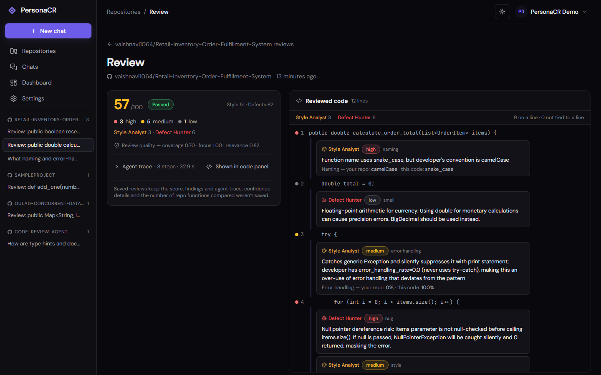<br><sub>**Review result (normal).** Score 57, 3 high / 5 medium / 1 low, CRScore-style quality; all 9 findings are tied to a line.</sub> |
| 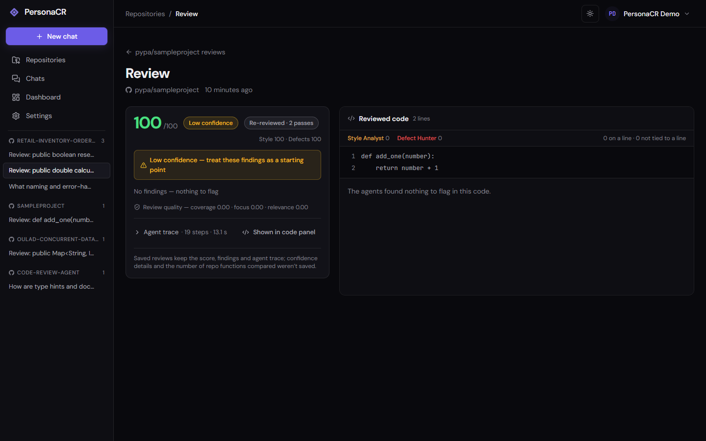<br><sub>**Review result (low confidence).** A two-line in-style function: no findings, so the confidence heuristic says 55% and explains why (only 3 similar functions, no findings, extreme scores).</sub> | 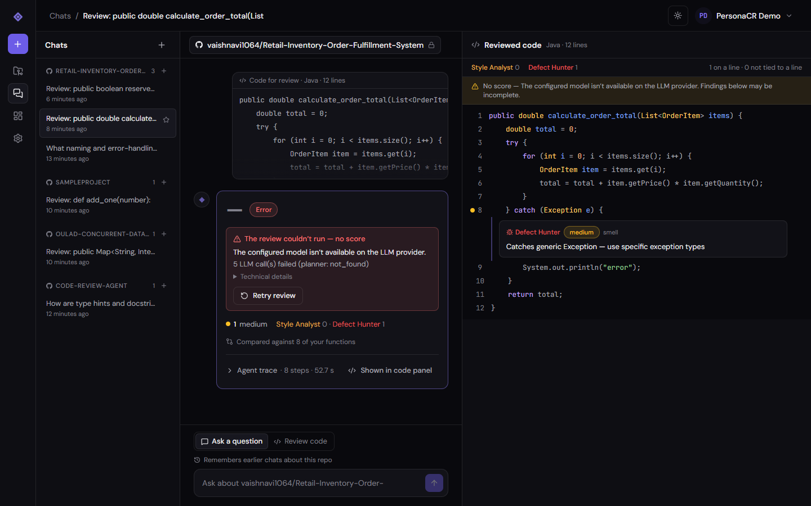<br><sub>**Review result (error).** A real run with an *induced* provider failure: I pointed the worker at a model name that doesn't exist, so all 5 LLM calls returned 404. No score is shown; the deterministic AST finding (line 8) survives. Setting reverted afterwards.</sub> |
| 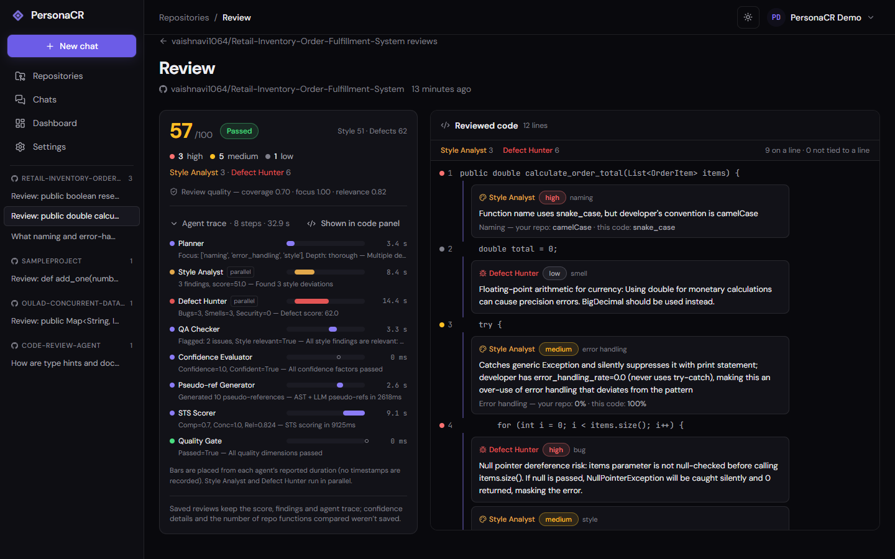<br><sub>**Agent trace, expanded.** Each agent's duration and decision; Style Analyst and Defect Hunter ran in parallel.</sub> | 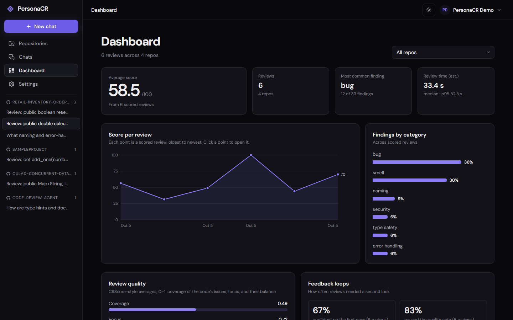<br><sub>**Dashboard (all repos).** 6 saved reviews across 4 repos: score per review, findings by category, review time.</sub> |
| 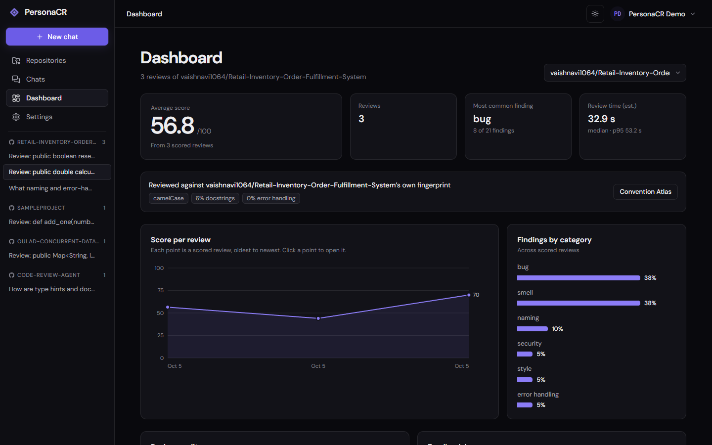<br><sub>**Dashboard (one repo).** Filtered to one repo, with the fingerprint it was reviewed against.</sub> | 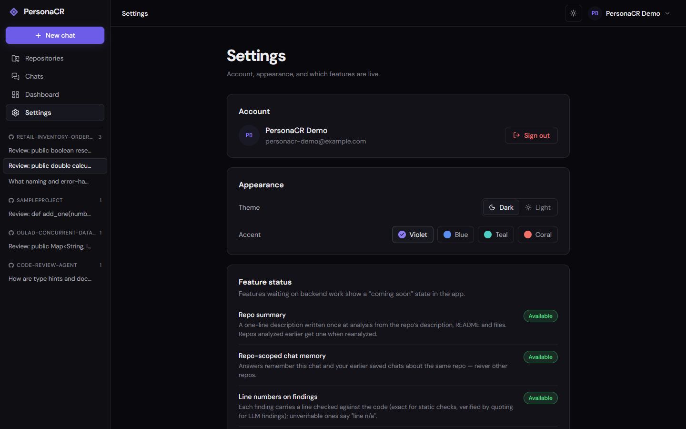<br><sub>**Settings.** Account, theme/accent, and which features are live.</sub> |
| 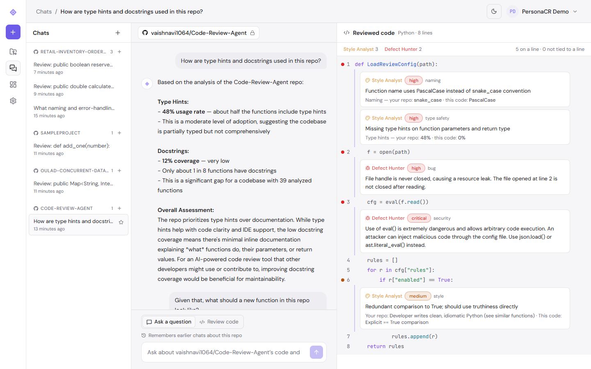<br><sub>**Light mode.** The Studio from the hero image, light theme.</sub> | 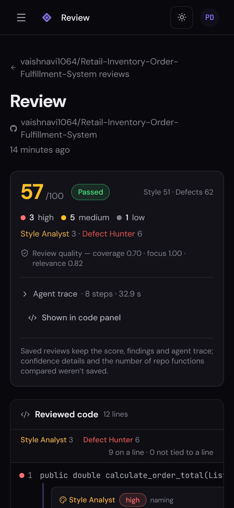<br><sub>**Mobile (375 px).** A saved review on a phone-width screen.</sub> |

---

## How it works

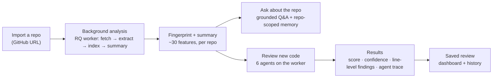
```mermaid
flowchart LR
  A["Import a repo<br/>(GitHub URL)"] --> B["Background analysis<br/>RQ worker: fetch → extract → index → summary"]
  B --> C["Fingerprint + summary<br/>~30 features, per repo"]
  C --> D["Ask about the repo<br/>grounded Q&A + repo-scoped memory"]
  C --> E["Review new code<br/>6 agents on the worker"]
  E --> F["Results<br/>score · confidence · line-level findings · agent trace"]
  F --> G["Saved review<br/>dashboard + history"]
```

1. **Import.** Paste `owner/repo`. The API queues an analysis job and returns at once; the card and dialog show the worker's live stage. Closing the tab doesn't stop it.
2. **Analyze.** The worker fetches source files (11 languages, 13 file extensions), splits them into function- and file-level chunks, computes the fingerprint, embeds every chunk with a code embedding model, and asks the LLM for a one-line summary grounded in the README, description and file names.
3. **Fingerprint.** Stored per repo in Postgres and reused until you reanalyze (the commit SHA is checked).
4. **Ask.** The Insights agent answers from the fingerprint, recent saved reviews, retrieved code, the last 8 turns of this chat, and up to 3 earlier chats about the same repo.
5. **Review.** The UI enqueues a review job and polls it. On the worker: Planner → (Style Analyst ‖ Defect Hunter) → QA Checker → Confidence → CRScore-style quality gate, with two feedback loops.
6. **Results.** Findings carry an integer line (checked against the code) and, for style, the repo's value vs. this code's. Signed-in users' reviews are saved for the dashboard; failed LLM calls produce a *degraded* or *error* result, never a fake confident score.

---

## Architecture

### System

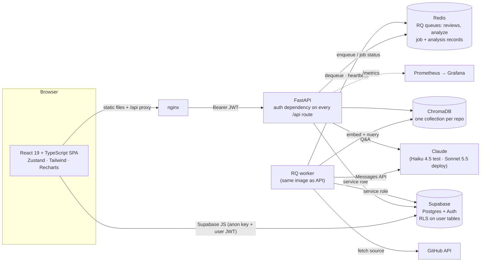
```mermaid
flowchart LR
  subgraph Browser
    UI["React 19 + TypeScript SPA<br/>Zustand · Tailwind · Recharts"]
  end
  UI -->|"static files + /api proxy"| NG["nginx"]
  NG -->|"Bearer JWT"| API["FastAPI<br/>auth dependency on every /api route"]
  UI -->|"Supabase JS (anon key + user JWT)"| SB[("Supabase<br/>Postgres + Auth<br/>RLS on user tables")]
  API -->|"enqueue / job status"| RQ[("Redis<br/>RQ queues: reviews, analyze<br/>job + analysis records")]
  W["RQ worker<br/>(same image as API)"] -->|"dequeue · heartbeat"| RQ
  API -->|"service role"| SB
  W -->|"service role"| SB
  W -->|"embed + query"| CH[("ChromaDB<br/>one collection per repo")]
  API --> CH
  W -->|"Messages API"| CL["Claude<br/>(Haiku 4.5 test · Sonnet 5.5 deploy)"]
  API -->|"Q&A"| CL
  W -->|"fetch source"| GH["GitHub API"]
  API -. "/metrics" .-> PR["Prometheus → Grafana"]
```

The API stays light: it verifies tokens, enqueues jobs, answers Q&A and serves status. Everything heavy (cloning, embedding, the six-agent review with its scoring model) runs on the worker. The browser reads and writes its own `user_reviews` / `user_repos` / `user_chats` rows directly with the user's JWT; RLS limits it to its own rows. Fingerprints are written only by the backend (service role).

<details>
<summary><b>Sequence: analyze job (stages, heartbeats, index swap)</b></summary>

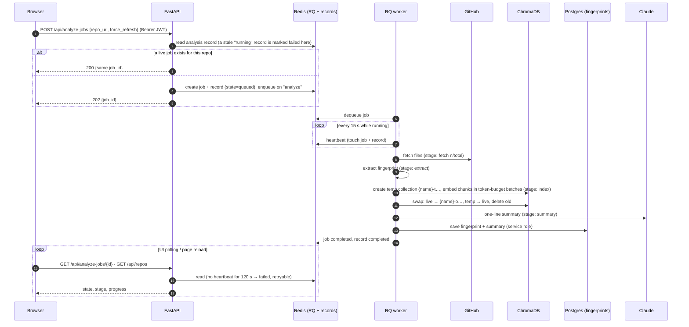
```mermaid
sequenceDiagram
  autonumber
  participant UI as Browser
  participant API as FastAPI
  participant R as Redis (RQ + records)
  participant W as RQ worker
  participant G as GitHub
  participant C as ChromaDB
  participant P as Postgres (fingerprints)
  participant L as Claude

  UI->>API: POST /api/analyze-jobs {repo_url, force_refresh} (Bearer JWT)
  API->>R: read analysis record (a stale "running" record is marked failed here)
  alt a live job exists for this repo
    API-->>UI: 200 {same job_id}
  else
    API->>R: create job + record (state=queued), enqueue on "analyze"
    API-->>UI: 202 {job_id}
  end
  W->>R: dequeue job
  loop every 15 s while running
    W->>R: heartbeat (touch job + record)
  end
  W->>G: fetch files (stage: fetch n/total)
  W->>W: extract fingerprint (stage: extract)
  W->>C: create temp collection {name}-t…, embed chunks in token-budget batches (stage: index)
  W->>C: swap: live → {name}-o…, temp → live, delete old
  W->>L: one-line summary (stage: summary)
  W->>P: save fingerprint + summary (service role)
  W->>R: job completed, record completed
  loop UI polling / page reload
    UI->>API: GET /api/analyze-jobs/{id} · GET /api/repos
    API->>R: read (no heartbeat for 120 s → failed, retryable)
    API-->>UI: state, stage, progress
  end
```

If the worker dies mid-job, the heartbeats stop; the next read marks the job failed ("The background worker stopped… Try again"), and a forced Reanalyze starts a new job. The live index is untouched because the new vectors were being built in a temporary collection. RQ's own failure hooks (`on_failure`, `work_horse_killed_handler`) mark it failed sooner when RQ can tell.
</details>

<details>
<summary><b>Sequence: review job via the worker</b></summary>

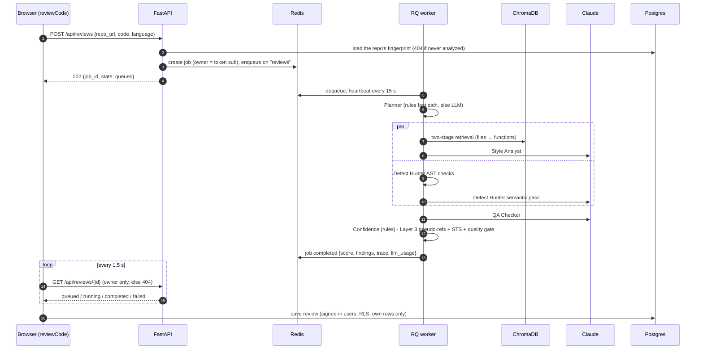
```mermaid
sequenceDiagram
  autonumber
  participant UI as Browser (reviewCode)
  participant API as FastAPI
  participant R as Redis
  participant W as RQ worker
  participant C as ChromaDB
  participant L as Claude
  participant P as Postgres

  UI->>API: POST /api/reviews {repo_url, code, language}
  API->>P: load the repo's fingerprint (404 if never analyzed)
  API->>R: create job (owner = token sub), enqueue on "reviews"
  API-->>UI: 202 {job_id, state: queued}
  W->>R: dequeue, heartbeat every 15 s
  W->>W: Planner (rules fast path, else LLM)
  par
    W->>C: two-stage retrieval (files → functions)
    W->>L: Style Analyst
  and
    W->>W: Defect Hunter AST checks
    W->>L: Defect Hunter semantic pass
  end
  W->>L: QA Checker
  W->>W: Confidence (rules) · Layer 3 pseudo-refs + STS + quality gate
  W->>R: job completed {score, findings, trace, llm_usage}
  loop every 1.5 s
    UI->>API: GET /api/reviews/{id} (owner only, else 404)
    API-->>UI: queued / running / completed / failed
  end
  UI->>P: save review (signed-in users, RLS: own rows only)
```

The synchronous `POST /api/review` still exists for API and MCP clients, but the UI never calls it, so the scoring model never loads in the API pod.
</details>

<details>
<summary><b>Sequence: auth (Supabase JWT → backend verification → RLS)</b></summary>

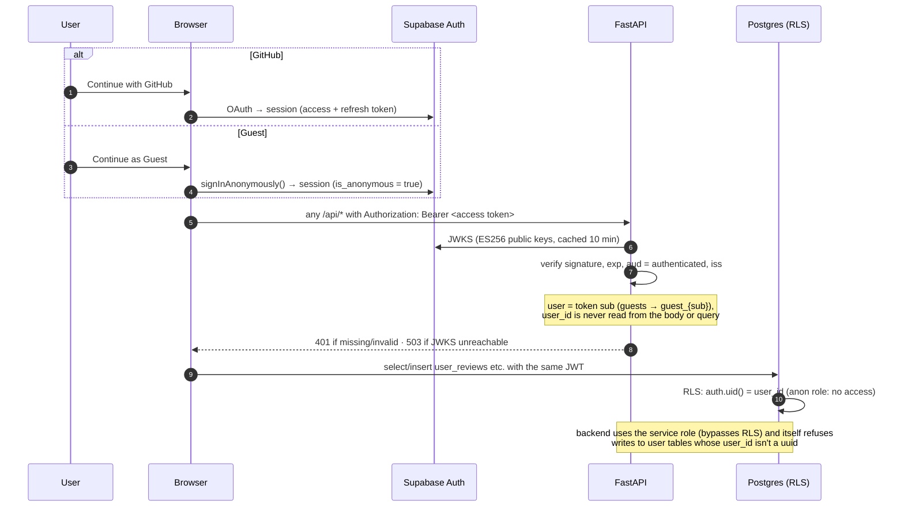
```mermaid
sequenceDiagram
  autonumber
  participant U as User
  participant UI as Browser
  participant SA as Supabase Auth
  participant API as FastAPI
  participant PG as Postgres (RLS)

  alt GitHub
    U->>UI: Continue with GitHub
    UI->>SA: OAuth → session (access + refresh token)
  else Guest
    U->>UI: Continue as Guest
    UI->>SA: signInAnonymously() → session (is_anonymous = true)
  end
  UI->>API: any /api/* with Authorization: Bearer <access token>
  API->>SA: JWKS (ES256 public keys, cached 10 min)
  API->>API: verify signature, exp, aud = authenticated, iss
  Note over API: user = token sub (guests → guest_{sub}),<br/>user_id is never read from the body or query
  API-->>UI: 401 if missing/invalid · 503 if JWKS unreachable
  UI->>PG: select/insert user_reviews etc. with the same JWT
  PG->>PG: RLS: auth.uid() = user_id (anon role: no access)
  Note over API,PG: backend uses the service role (bypasses RLS) and itself refuses<br/>writes to user tables whose user_id isn't a uuid
```
</details>

### The six-agent review pipeline

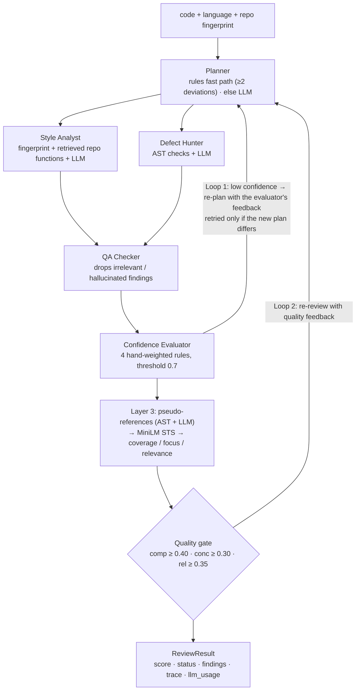
```mermaid
flowchart TB
  IN["code + language + repo fingerprint"] --> PL["Planner<br/>rules fast path (≥2 deviations) · else LLM"]
  PL --> SA["Style Analyst<br/>fingerprint + retrieved repo functions + LLM"]
  PL --> DH["Defect Hunter<br/>AST checks + LLM"]
  SA --> QA["QA Checker<br/>drops irrelevant / hallucinated findings"]
  DH --> QA
  QA --> CE["Confidence Evaluator<br/>4 hand-weighted rules, threshold 0.7"]
  CE -->|"Loop 1: low confidence → re-plan with the evaluator's feedback<br/>retried only if the new plan differs"| PL
  CE --> L3["Layer 3: pseudo-references (AST + LLM)<br/>→ MiniLM STS → coverage / focus / relevance"]
  L3 --> QG{"Quality gate<br/>comp ≥ 0.40 · conc ≥ 0.30 · rel ≥ 0.35"}
  QG -->|"Loop 2: re-review with quality feedback"| PL
  QG --> OUT["ReviewResult<br/>score · status · findings · trace · llm_usage"]
```

- **Parallel:** Style Analyst and Defect Hunter run concurrently (`asyncio.gather`); on a Loop 1 retry only what depends on the plan re-runs (Defect Hunter's output is reused).
- **Capped:** at most 2 iterations. Any LLM failure stops both loops and returns `degraded` (some calls failed) or `error` (all failed), with no score.
- The **Orchestrator** (a mediator) owns the sequence, the loops and the trace; agents never call each other.

<details>
<summary><b>Data model: Postgres tables, RLS, Chroma collections, Redis keys</b></summary>

**Postgres (Supabase)**, migrations in [`migrations/`](migrations/) (`001`–`010`)

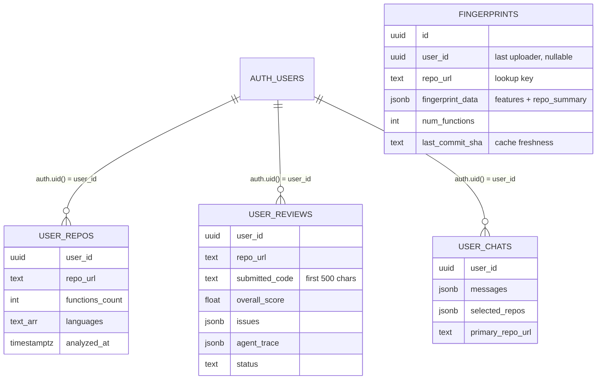
```mermaid
erDiagram
  AUTH_USERS ||--o{ USER_REPOS : "auth.uid() = user_id"
  AUTH_USERS ||--o{ USER_REVIEWS : "auth.uid() = user_id"
  AUTH_USERS ||--o{ USER_CHATS : "auth.uid() = user_id"
  FINGERPRINTS {
    uuid id
    uuid user_id "last uploader, nullable"
    text repo_url "lookup key"
    jsonb fingerprint_data "features + repo_summary"
    int num_functions
    text last_commit_sha "cache freshness"
  }
  USER_REPOS {
    uuid user_id
    text repo_url
    int functions_count
    text_arr languages
    timestamptz analyzed_at
  }
  USER_REVIEWS {
    uuid user_id
    text repo_url
    text submitted_code "first 500 chars"
    float overall_score
    jsonb issues
    jsonb agent_trace
    text status
  }
  USER_CHATS {
    uuid user_id
    jsonb messages
    jsonb selected_repos
    text primary_repo_url
  }
```

| Table | Who writes | RLS |
|---|---|---|
| `user_repos`, `user_reviews`, `user_chats` | browser (user JWT); worker writes `user_repos` (service role) | `authenticated`: select/insert/update/delete only where `auth.uid() = user_id` (update `WITH CHECK` blocks reassigning rows). `anon`: no access. |
| `fingerprints` | backend only (service role) | RLS on, no policies, `anon`/`authenticated` revoked |
| `reviews`, `chat_messages`, `documentation`, `agent_traces` | nothing (legacy, empty) | locked the same way (`010`) |

`user_reviews.user_id` and `user_repos.user_id` were `text` in the live project (schema drift); `009` converted them to `uuid` and recreated the policies.

**ChromaDB.** One collection per repository, shared by everyone who analyzes it: `pcr-{repo name, 30 chars}-{md5("owner__repo")[:16]}`, cosine space. Each chunk is stored with `granularity` = `file` or `function` plus file path, language, function name and line range. During a rebuild a temporary `…-t<8 hex>` collection exists; the old one is briefly renamed `…-o<8 hex>` during the swap.

**Redis.**

| Key | Contents | TTL |
|---|---|---|
| `personacr:job:{job_id}` | job status (state, progress, message, result, error, `meta.user_id` owner) | 7 days |
| `personacr:analysis:{user_id}:{repo_hash}` | latest analysis of that repo for that user (stage, progress, error, summary; guests' fingerprints live here) | 7 days |
| `personacr:analyses:{user_id}` | set of repo hashes the user analyzed | 7 days |
| `rq:*` | RQ queues (`reviews`, `analyze`), registries, results | RQ defaults (results/failures 24 h) |
</details>

<details>
<summary><b>The style fingerprint (~30 features: what and how each is measured)</b></summary>

`pattern_extractor.extract_fingerprint` aggregates per-function signals into 31 fields ([`FingerprintData`](backend/src/core/models.py)). Comment, conditional, loop, style, indentation, line-length and import features follow the feature families in Ghaleb et al. (MSR 2026), repurposed from detecting AI agents to describing a repo's style.

| Group | Features | How it's measured |
|---|---|---|
| Size & complexity | avg / max function length, length Gini, estimated complexity | non-blank lines per function; complexity = 1 + count of branch keywords (an *estimate*, not true cyclomatic complexity) |
| Conventions | naming convention, docstring coverage, type-hint usage (+ sample size), error-handling rate | naming: majority of snake/camel/Pascal names. Docstrings: **Python AST**; other languages: a doc comment directly above the function (`/** */`, `///`, Go `//`). Type hints: **Python AST** and TypeScript signatures only; statically typed languages and plain JS are "not measured", never counted as typed. Error handling: `try` + `except`/`catch` present (regex). |
| Comments | comment density, inline-comment ratio, comment-to-code ratio | line-based, language-aware markers |
| Control flow | conditional density / per 100 lines, loop density, for-to-while ratio, comprehension ratio | keyword counts; comprehensions via **Python AST** only |
| Layout | indentation consistency, primary indent depth, avg / max / std line length, lines over 80 / 120 | per-line measurement |
| Imports | import density, wildcard-import ratio | regex over file-level chunks |
| Context | languages, language distribution, total functions, common patterns | file extension; regex pattern hints (early return, builder, singleton, …) |

**Function extraction:** Python uses the `ast` module (exact function boundaries). Java, JS/TS, Kotlin, Go, Rust, C/C++, C#, Ruby use a regex for the signature and take up to 60 lines as the body, which is approximate. Every file also gets a file-level chunk for two-stage retrieval.
</details>

<details>
<summary><b>Retrieval and embeddings</b></summary>

- **Model:** `jinaai/jina-embeddings-v2-base-code` (768-dim) via fastembed/ONNX on CPU.
- **Two-stage retrieval** (`query_similar_staged`): the Style Analyst finds the 3 most similar *files* first, then up to 8 most similar *functions* within them (same language), so the Style Analyst sees both context and close matches (after Ringer et al.'s multi-granularity fingerprinting).
- **Memory-bounded indexing:** Jina's attention cost grows with tokens², and fastembed pads a batch to its longest text. Every text is capped at `MAX_EMBED_TOKENS` (2048 by default, 1024 in k8s), and batches are cut so that `batch size × longest text ≤ EMBED_TOKEN_BUDGET`. Vectors are written per batch, never accumulated. See [challenges](#engineering-challenges).
- **Build-aside swap:** a rebuild never touches the live collection until every chunk is in.
- **Visible misses:** a missing or empty collection logs a warning, and the review result carries `retrieval_examples` (how many repo functions the Style Analyst actually saw).
</details>

<details>
<summary><b>LLM layer</b></summary>

- **One client** ([`core/llm_client.py`](backend/src/core/llm_client.py)): `complete(system, user, temperature, max_tokens)`. `LLM_PROVIDER` = `anthropic` (default) or `groq`; `LLM_MODEL` = `claude-haiku-4-5-20251001` for testing, `claude-sonnet-5-5` for deploy. No agent imports a provider SDK.
- **Per-call logging:** provider, model, calling agent, input/output tokens, latency.
- **Typed failures:** `LLMError(kind = not_found | rate_limit | auth | bad_request | api | connection | empty | refusal | client)`.
- **Per-review tracking:** `track()` (a ContextVar copied into the parallel branches) records every call and failure. Any failure means no score, `is_confident = false`, status `degraded` or `error`, with the reason and `llm_usage` (calls, tokens, failures) in the result.
- **Sampling:** temperature is sent via `extra_body` where the model accepts it and omitted for models that reject sampling parameters.
</details>

---

## Design decisions & trade-offs

| Decision | Why | Trade-off |
|---|---|---|
| **AST/code fingerprint as the cold-start signal** (not PR/review history) | Works on any public repo on day one: no review history, config files or fine-tuning needed | Measures what the code *does*, not what reviewers *ask for*; some features are approximations outside Python |
| **Per-repo fingerprints, never merged** | A Java service and a Python notebook repo have different norms; merging would average them into nobody's style | No "personal style across all my repos" view |
| **Async jobs on Redis/RQ** for analysis and reviews | Analyses take minutes and reviews ~30–60 s; the API must stay responsive, and the model must not load in the API pod | More moving parts (Redis, worker, polling, liveness handling) |
| **Heartbeat + stale-on-read**, plus RQ failure hooks | RQ can't see a whole pod being killed; a heartbeat makes "running forever" impossible | A crashed job reads as failed only ~2 min later (`JOB_STALE_SECONDS`) |
| **Build-aside index swap** | A killed or failed re-index must never leave a partial index serving reviews | Briefly needs room for two copies of a repo's vectors |
| **Heuristic confidence score** | Instant, explainable reasons ("only 3 similar functions found") that drive Loop 1 | Hand-set weights (0.3/0.3/0.2/0.2) and a 0.7 cut-off, uncalibrated, so it is a *triage signal, not a probability* |
| **Supabase anonymous sign-in for guests** | One auth path: every `/api` call carries a verified JWT, and guest IDs can't be forged | Anonymous users accumulate in `auth.users` (no cleanup job yet) |
| **CPU-only torch in the image** | No GPU anywhere; the CUDA wheels were 4.1 GB of dead weight | `requirements.txt` still resolves CUDA torch on Linux outside the image |
| **Haiku 4.5 for testing, Sonnet 5.5 for deploy** | Cheap, fast iteration (a measured review: 7 calls, ≈$0.012 at list price); the stronger model for real use | All measurements here use Haiku; Sonnet quality and cost are not measured yet |

---

## Engineering challenges

Each one: **problem → diagnosis → fix → evidence.** Numbers come from commit messages, tests or [`evals/results/ops_measurements.json`](evals/results/ops_measurements.json) (with provenance per value).

<details>
<summary><b>Analysis OOM-killed the backend (quadratic attention)</b></summary>

- **Problem:** `analyze-repo` was OOMKilled at the 3 GiB limit.
- **Diagnosis:** not chunk count. Jina v2 attention is O(tokens²) and fastembed pads a batch to its longest text. Measured in the image: a ~3k-token file added +1.6 GiB; a ~7.5k-token file was SIGKILLed with no limit.
- **Fix:** cap every text at `MAX_EMBED_TOKENS`; cut batches by a token budget; write per batch.
- **Evidence:** [`f0dae99`](https://github.com/vaishnavi1064/PersonaCR/commit/f0dae99): 1, 4 and 32 × 30k-char files then peaked at 1.62–1.73 GiB under `--memory=3g`. Later, on minikube, analyzing PersonaCR itself (493 chunks): backend peak **3071 → 1443 MiB**, embedding batches **493 → 244**, wall time **29.6 → 20.7 min**. That is the *combined* effect of three changes (padding fix, 1024-token cap, lazy MiniLM; see `caveat_on_before_after`).
</details>

<details>
<summary><b>Tokenizer padding made every batch a single chunk</b></summary>

- **Problem:** token-budget batching produced 1-chunk batches; ~28 min of embedding.
- **Diagnosis:** fastembed pads `encode_batch` output to the longest text, so `len(ids)` reported ~2048 tokens for every chunk.
- **Fix:** count real tokens with `sum(attention_mask)`. The test's fake tokenizer now pads like fastembed, and the regression test fails on the old code.
- **Evidence:** [`eb63cb4`](https://github.com/vaishnavi1064/PersonaCR/commit/eb63cb4): offline on PersonaCR, **493 → 145 batches** at 2048 tokens.
</details>

<details>
<summary><b>Async reviews never ran in k8s (no worker)</b></summary>

- **Problem:** `POST /api/reviews` enqueued jobs that stayed `queued` forever.
- **Diagnosis:** nothing in k8s or Compose consumed the queue.
- **Fix:** a worker Deployment (same image, `python -m backend.src.workers.worker`) and a Compose profile; then an initContainer that waits for Redis.
- **Evidence:** [`85a5598`](https://github.com/vaishnavi1064/PersonaCR/commit/85a5598), [`6136d90`](https://github.com/vaishnavi1064/PersonaCR/commit/6136d90): the worker had restarted 4 times on a fresh apply (Redis connection refused) before the wait was added.
</details>

<details>
<summary><b>ChromaDB client/server version mismatch</b></summary>

- **Problem:** the k8s ChromaDB StatefulSet wasn't actually used, and couldn't be.
- **Diagnosis:** server image `0.5.23` vs client `chromadb==1.5.7`; a 1.x client can't talk to a 0.x server, and 1.x persists to `/data`.
- **Fix:** use `HttpClient` when `CHROMADB_URL` is set; server bumped to `1.5.7`; PVC moved to `/data`.
- **Evidence:** [`b4443ae`](https://github.com/vaishnavi1064/PersonaCR/commit/b4443ae), with tests for client selection.
</details>

<details>
<summary><b>An identity bug made retrieval silently empty</b></summary>

- **Problem:** reviews ran with no similar-code examples and no error.
- **Diagnosis:** analyze embedded into a collection named from the *caller's* user id; review and Q&A queried one named from the *repo owner*. A non-uuid user id also made the fingerprint insert fail (HTTP 400).
- **Fix:** one per-repo identity (`repo_identity(repo_url)`) for every collection; uuid-only `user_id`; retrieval misses now log a warning and report `retrieval_examples`.
- **Evidence:** [`b337289`](https://github.com/vaishnavi1064/PersonaCR/commit/b337289), [`5d7bc46`](https://github.com/vaishnavi1064/PersonaCR/commit/5d7bc46); test: analyze as user A, review as user B → more than 0 examples.
</details>

<details>
<summary><b>Groq retired the model, then the Anthropic SDK 1.x broke temperature</b></summary>

- **Problem 1:** every agent call returned 404: Groq retired `llama-3.3-70b-versatile`, which six callers hard-coded.
- **Fix 1:** the provider-agnostic `llm_client`, Claude by default ([`0b64d33`](https://github.com/vaishnavi1064/PersonaCR/commit/0b64d33)).
- **Problem 2:** the first live review made *zero* Anthropic requests. `anthropic>=1.0` removed `temperature` from `messages.create()`, so every call raised `TypeError`, slipped past error mapping, and the review came back "low_confidence, score 85".
- **Fix 2:** temperature via `extra_body`; any unexpected exception becomes `LLMError(kind="client")` and degrades the review. The test fake now binds arguments against the real SDK signature, and the new assertions fail on the old client ([`5da5d58`](https://github.com/vaishnavi1064/PersonaCR/commit/5da5d58)).
</details>

<details>
<summary><b>Silent LLM failures produced fake confident reviews</b></summary>

- **Problem:** with every LLM call failing, reviews still came back "completed", confident, score 60, with two "issues" that were the error strings themselves.
- **Fix:** a per-review failure tracker; any failure stops both loops, so there are no extra calls. Status `degraded`/`error`, no score, not confident, a reason, and `llm_usage`. Agents no longer turn exceptions into findings; the deterministic AST findings are kept.
- **Evidence:** [`3729dfc`](https://github.com/vaishnavi1064/PersonaCR/commit/3729dfc); tests for all-fail → `error` and one-agent-fail → `degraded`; the [error screenshot](docs/screenshots/10-review-error.png) is this path on a real (induced) provider failure.
</details>

<details>
<summary><b>Loop 1 retried with byte-identical inputs</b></summary>

- **Problem:** a measured live review made 7 LLM calls, and 6 of them were the same 3 calls made twice.
- **Diagnosis:** on low confidence the Planner got the same inputs and returned the same plan.
- **Fix:** the re-plan now receives the evaluator's reason and suggestion; the retry runs **only if the plan changed**, and then only plan-dependent agents re-run.
- **Evidence:** [`06dc333`](https://github.com/vaishnavi1064/PersonaCR/commit/06dc333); `claude_review` in `ops_measurements.json` (7 calls, 4,626 input / 1,403 output tokens, ≈$0.0116 estimated at list price, before the fix); tests for unchanged plan → 1 iteration and changed plan → only Style/QA run twice.
</details>

<details>
<summary><b>Stuck jobs after a worker crash, plus a partial index</b></summary>

- **Problem (minikube, real Redis):** restarting the worker mid-analysis left the job `running / index / 70%` forever. "Reanalyze" returned the same stuck job (HTTP 200), and the repo's index was left with **50 of 108** vectors.
- **Fix:** 15 s heartbeats; a running job with no heartbeat for 120 s reads as failed; a forced Reanalyze replaces it; a superseded job can't overwrite its replacement; RQ `on_failure` and `work_horse_killed_handler` hooks; `terminationGracePeriodSeconds: 300`. Separately, the index is built into a temporary collection and swapped in only on success.
- **Evidence:** [`941f536`](https://github.com/vaishnavi1064/PersonaCR/commit/941f536) (17 tests), [`c50878f`](https://github.com/vaishnavi1064/PersonaCR/commit/c50878f) (7 tests on a real embedded Chroma). Re-verified on minikube: graceful restart → job **completed** (+132 s), index 108/108; force-kill → **failed at +136 s** with the reason, index still 108; forced Reanalyze → new job, completed in 104 s ([raw logs](evals/results/ops_logs/2026-10-05_minikube/)).
</details>

<details>
<summary><b>Reviews ran in the API pod (2.5 GiB → 131 MiB)</b></summary>

- **Problem:** the UI called the synchronous `/api/review`, so every review loaded torch and the scoring model into the API process: **2,501 MiB** of its 3 GiB limit after one review, while the worker sat idle.
- **Fix:** the UI enqueues `POST /api/reviews` and polls, with a "Queued — waiting for a worker" state and no silent fallback to the sync endpoint.
- **Evidence:** [`ccdcdb7`](https://github.com/vaishnavi1064/PersonaCR/commit/ccdcdb7) (5 tests). On minikube after the fix, the shipped `reviewCode()` was queued at +2 s, running at +4 s, and done at 47 s on the worker; the backend pod was at **131 MiB** afterwards, and the node peaked at **3.87 GiB** (previously 5.16 GiB).
</details>

<details>
<summary><b>CUDA wheels in a CPU-only image (6.87 GB → 2.13 GB)</b></summary>

- **Problem:** `sentence-transformers` pulled the default Linux torch build: torch 2.14.1 + CUDA 13, with 3.2 GB of `nvidia-*` wheels and 0.9 GB of `triton`.
- **Fix:** install `torch==2.14.1` from the PyTorch CPU index before `requirements.txt`; the build fails if any CUDA package appears.
- **Evidence:** [`4a2fd2f`](https://github.com/vaishnavi1064/PersonaCR/commit/4a2fd2f); image **6,874,412,538 → 2,131,835,003 bytes** (measured the same way, inside minikube's Docker).
</details>

<details>
<summary><b>Type-hint and docstring measurement bugs outside Python</b></summary>

- **Problem 1:** Java repos reported **100% type hints**, because every non-Python function counted as "typed".
- **Problem 2:** Javadoc detection looked anywhere in a 60-line chunk, missing a function's own doc comment and counting the next one's.
- **Fix:** measure type hints only where they're optional (Python AST, TypeScript signatures), with a sample size, and "not measured" otherwise; the ingestor records whether a doc comment sits directly above the function. A follow-up fix hides the type-hint chip when the measured sample doesn't represent the repo (one repo had 2 typed Python helpers among 128 Java functions: "100% of 2").
- **Evidence:** [`43102dc`](https://github.com/vaishnavi1064/PersonaCR/commit/43102dc) (15 tests), [`3620d00`](https://github.com/vaishnavi1064/PersonaCR/commit/3620d00).
</details>

<details>
<summary><b>Security: no backend auth → JWT + RLS + text→uuid migration</b></summary>

- **Problem:** every route trusted a `user_id` from the request body or query, and RLS state was unknown.
- **Fix:** a FastAPI dependency verifies the Supabase JWT on every `/api` route via the project's JWKS; the user comes from `sub`; jobs are scoped to their owner. RLS migrations: `007` (own rows only), `008` (fingerprints service-role only), `009` (the live `text` user_id columns converted to `uuid`), `010` (unused legacy tables locked).
- **Evidence:** [`4222be2`](https://github.com/vaishnavi1064/PersonaCR/commit/4222be2), [`96a210c`](https://github.com/vaishnavi1064/PersonaCR/commit/96a210c). [`tests/test_auth.py`](tests/test_auth.py) enumerates every `/api` route and asserts 401 without a token, plus wrong key, expired, wrong audience/issuer, `alg: none` and HS256-confusion cases. The opt-in live test ([`tests/test_rls_live.py`](tests/test_rls_live.py)) passed **11/11** against the real project: two anonymous users can't read, change, delete, forge or reassign each other's rows.
</details>

---

## Evaluation

The honest headline: **the fingerprint measurably separates in-style from off-style code, but personalized review is not shown to beat generic review.**

<details open>
<summary><b>Personalization benchmark (N=14): inconclusive</b></summary>

**Setup.** 7 hand-built pairs of functions written against `psf/requests` (14 cases): one *in-style* and one deliberately *off-style* version of each task (wrong naming, missing type hints, unusual docstrings, comprehensions where requests uses loops). Each case was reviewed twice, by the **personalized** pipeline (real requests fingerprint) and the **generic** pipeline (empty fingerprint). Pairs and construction: [`evals/minimal_a_pairs_construction.md`](evals/minimal_a_pairs_construction.md).

**Fair shared-scale metric** ([framing](evals/shared_scale_framing.md)). Scoring each arm by its own findings is circular: the generic arm is told not to emit personal-pattern findings. So both arms are judged on one scale. First, feature distance between the submitted code and the requests fingerprint on 5 frozen, equally weighted features (material deviation ≥ 0.35). Then, whether each arm's findings *mention* the true material deviations, and whether they invent deviations on in-style code. Weights and threshold were fixed before re-measuring.

| Measure | Personalized | Generic |
|---|---|---|
| Distance gate: off-style farther from the fingerprint than in-style | **7 / 7 pairs** (mean distance 0.08 in-style vs 0.767 off-style) | (same code) |
| Off-style material deviations mentioned (recall) | **13 / 29 = 0.45** | **4 / 29 = 0.14** |
| False-positive deviation mentions on in-style code | **3 across 7 cases = 0.43 per case** | **2 across 7 cases = 0.29 per case** |
| Per-pair verdict | better on **2 / 7** pairs | better on **1 / 7** (wrong way) |
| **Verdict** | **inconclusive.** Higher recall but more false positives; N=14 is directional only, not statistically significant | |

Source: [`evals/results/shared_scale_metric.json`](evals/results/shared_scale_metric.json) (`n_full`).

**Measurement bugs fixed along the way** (the rigor story): the LLM's free-form style score ignored its own findings (now score = f(findings)); findings inverted the fingerprint's direction, e.g. "missing docstring" in a repo that rarely writes them (direction filter); personalized in-style false positives were 1.0 per case from praise, generic nits and paraphrases, and the fix brought them to **0.43** while off-style recall held at ~0.45 ([`809bffb`](https://github.com/vaishnavi1064/PersonaCR/commit/809bffb), [`a9b6f7a`](https://github.com/vaishnavi1064/PersonaCR/commit/a9b6f7a)). That cleaner number is a side effect of a real bug fix, not a re-tune toward a win.

**Model.** These numbers came from **Llama 3.3 70B on Groq** (July 2026), which Groq has since retired. The pipeline now runs on Claude, so **a Claude re-run is a new benchmark** and must be reported separately, not appended to these numbers.
</details>

<details>
<summary><b>Defect Hunter eval (small, keyword-scored)</b></summary>

[`evals/run_eval.py`](evals/run_eval.py) runs `hunt_defects()` directly on [`evals/test_set.json`](evals/test_set.json): 19 hand-labeled Python snippets, 15 seeded defects (bug / smell / security) and 4 clean snippets.

| Prompt | Seeded defects caught | False-positive findings on the 4 clean snippets |
|---|---|---|
| v1 | 14 / 15 | 12 (3.0 per clean snippet) |
| v2 | 14 / 15 | 5 (1.25 per clean snippet) |

**Caveats:** a "catch" is a keyword match, not a human judgment; the set is small and hand-built; it ran once per prompt (May 2026, Llama 3.3 70B on Groq), so it isn't comparable to the current Claude pipeline. The file's `false_positive_rate_pct` (300% / 125%) is findings per clean snippet, not a percentage of anything. Results: [`evals/results/eval_v1.json`](evals/results/eval_v1.json), [`eval_v2.json`](evals/results/eval_v2.json).
</details>

<details>
<summary><b>In-pipeline metrics (internal signals only)</b></summary>

Layer 3 is CRScore-inspired (Naik et al.): pseudo-references from AST checks + LLM, sentence similarity with `all-MiniLM-L6-v2`, then coverage (recall), focus (precision) and relevance (F1), and a rules-based quality gate that can trigger Loop 2. These numbers steer the pipeline and appear on the dashboard as "Review quality". **They are not evidence that reviews are correct or that personalization works.**
</details>

<details>
<summary><b>Ops measurements (single runs, local hardware)</b></summary>

From [`evals/results/ops_measurements.json`](evals/results/ops_measurements.json); every value is tagged `archived_log`, `offline_recount` or `session_only`. Single runs on a 6 GiB minikube node, so there is no variance estimate.

| Measurement | Value |
|---|---|
| Analyze PersonaCR (493 chunks), backend peak memory | 3071 MiB → 1443 MiB (three changes combined) |
| Analyze Retail-Inventory (108 chunks), wall time on the worker | 105 s |
| One Claude Haiku review on the worker (before the Loop 1 fix) | 7 calls · 4,626 in / 1,403 out tokens · ≈$0.0116 (list-price estimate) · 65.1 s |
| UI review on the worker (after the fixes) | 47 s client-side; backend pod 131 MiB after |
| Backend image | 6.87 GB → 2.13 GB |
| Worker crash mid-job → failed, retryable | +136 s |
</details>

---

## Security & privacy

<details>
<summary><b>What's protected, what's stored, guest data lifecycle</b></summary>

**Protected**
- Every `/api/*` route requires a valid Supabase access token (ES256 via JWKS; HS256 only if a legacy secret is configured; audience and issuer checked). `/health` and `/metrics` are open. The user is always the token's `sub`.
- Job status is visible only to the job's owner (others get 404, like an unknown job).
- RLS on the user tables (own rows only), `fingerprints` service-role only, legacy tables locked; the live RLS test covers cross-user reads, updates, deletes, forged inserts and reassignment.
- The backend's service-role writes refuse non-uuid `user_id`s for user tables, since the service role bypasses RLS.
- Secrets live in `backend/.env` / `k8s/secret.yaml` (gitignored); `.dockerignore` keeps them out of images.

**Stored**
- *Signed-in users:* imported repo list, saved reviews (score, findings, trace, first 500 characters of the submitted code), chats (messages, selected repo).
- *Per repo (shared):* fingerprint + summary in Postgres, chunk embeddings and chunk text in Chroma. Only **public** repo code is analyzed in the app flow.
- *Jobs:* status records in Redis for 7 days.

**Guests** (Supabase anonymous sign-in)
- Nothing is written to Postgres: no saved reviews, repos or chats. Guest analysis records (including the fingerprint) live only in Redis, keyed `guest_<sub>`, for 7 days.
- Chroma collections a guest built are deleted on sign-out and, best effort, on tab close (a keepalive request with the guest's token; a guest can only clean up its own session). Collections are shared per repo, so this can drop a cache another user would otherwise reuse; the next analysis rebuilds it.
- The anonymous user itself stays in `auth.users`; there is no automatic cleanup yet.
</details>

## Observability

<details>
<summary><b>Metrics, dashboards, traces, token usage</b></summary>

- **Prometheus** at `GET /metrics`: `personacr_review_latency_seconds` (per agent), `personacr_review_total` (by outcome), `personacr_self_correction_total` (Loop 1/2 results, including "unchanged" skips), `personacr_groq_throttled_total` (provider rate limits; name kept for the dashboard).
- **Grafana:** provisioned dashboard in [`observability/grafana/`](observability/grafana/); runs via Docker Compose (Prometheus :9090, Grafana :3001) or the k8s manifests.
- **Agent trace:** every stage appends name, decision, duration and iteration to the result, shown as the expandable timeline in the UI.
- **Token usage:** each LLM call logs tokens and latency; each review returns `llm_usage` (calls, input/output tokens, failures).
- Dev/portfolio scale: no alerting or SLOs.
</details>

## Testing

<details>
<summary><b>Backend, frontend, live RLS, CI</b></summary>

| Suite | Count | Covers |
|---|---|---|
| Backend `pytest` | **272 collected**; last local run: 260 passed, 11 skipped (opt-in live RLS), 1 deselected (live LLM) | auth (every `/api` route → 401, token attacks, user from `sub`, job ownership), job liveness and RQ hooks, build-aside index swap (real embedded Chroma), embedding batching and padding, fingerprint features per language, LLM client failure modes and degraded reviews, Loop 1/Loop 2 behavior, retrieval identity, chat memory, repo list, review queue, metrics |
| Frontend `vitest` | **87** | API client (token on every call, no `user_id` sent, review enqueue + polling, API base URL), normalizers, analysis status, dashboard stats, timeline |
| Live RLS (`PERSONACR_RLS_LIVE=1`) | 11 | anon key reads/writes nothing; two anonymous users can't touch each other's rows. Passed 11/11 against the live project |
| Live LLM (`-m groq`, name kept) | 1 | real provider call; excluded from CI |

**CI** ([`.github/workflows/ci.yml`](.github/workflows/ci.yml)) runs on every push: a clean-install smoke test; lint and type checks (ruff, mypy, `tsc -b`, eslint, vitest, strict `npm ci` on the pinned Node from `frontend/.nvmrc`); and pytest excluding live-LLM tests.

There are no end-to-end browser tests in CI; the screenshots above came from a local Playwright harness that isn't part of the repo.
</details>

---

## Tech stack

| Area | Stack |
|---|---|
| Frontend | React 19, TypeScript, Vite, Zustand, Tailwind CSS v4, Recharts, Framer Motion, CodeMirror, Supabase JS |
| Backend | Python 3.12, FastAPI, Uvicorn, Pydantic, PyJWT, httpx, PyGithub |
| Jobs | Redis 7, RQ (worker on queues `reviews` + `analyze`) |
| AI | Claude via the Anthropic SDK (Haiku 4.5 test, Sonnet 5.5 deploy; Groq optional), Jina v2 code embeddings (fastembed/ONNX), `all-MiniLM-L6-v2` (sentence-transformers, CPU torch) |
| Data | Supabase (Postgres + Auth, RLS), ChromaDB 1.5.7 |
| Infra | Docker, Kubernetes manifests + Terraform for local minikube, nginx, Prometheus, Grafana, GitHub Actions, MCP via `fastapi-mcp` |

---

## Run it locally

<details>
<summary><b>Supabase, Redis, backend, worker, frontend</b></summary>

**Prerequisites:** Python 3.12, Node 24.21 (`frontend/.nvmrc`), Docker (for Redis), a Supabase project, an Anthropic API key.

**1. Supabase** (once)
- Run [`migrations/001`–`010`](migrations/) in the SQL editor (in order; `007`–`010` are idempotent).
- Authentication → Sign In / Providers: enable **GitHub** (OAuth) and **Allow anonymous sign-ins** (guests).

**2. Environment**

```bash
cp backend/.env.example backend/.env
# SUPABASE_URL, SUPABASE_SERVICE_ROLE_KEY, ANTHROPIC_API_KEY
# optional: GITHUB_TOKEN (rate limits), LLM_MODEL, REDIS_URL (default redis://localhost:6379/0)
cp frontend/.env.example frontend/.env
# VITE_API_URL=http://localhost:8000, VITE_SUPABASE_URL, VITE_SUPABASE_ANON_KEY
```

**3. Redis**

```bash
docker compose up -d redis
```

**4. Backend API** (repo root)

```bash
python -m venv .venv && source .venv/bin/activate      # Windows: .venv\Scripts\activate
pip install -r backend/requirements.txt
uvicorn backend.src.main:app --reload --port 8000      # OpenAPI at http://localhost:8000/docs
```

**5. Worker** (second terminal, same venv; runs analyses and reviews)

```bash
python -m backend.src.workers.worker                   # or: docker compose --profile worker up -d worker
```

**6. Frontend**

```bash
cd frontend && npm ci && npm run dev                   # http://localhost:5173
```

**Tests**

```bash
python -m pytest -m "not groq"                         # backend
cd frontend && npm test                                # frontend
PERSONACR_RLS_LIVE=1 python -m pytest -m integration tests/test_rls_live.py -v   # live RLS (opt-in)
```

**Observability (optional):** `docker compose up -d prometheus grafana`.

**Kubernetes:** [`k8s/README.md`](k8s/README.md) has the minikube walkthrough (build images into minikube, `k8s/secret.yaml`, `kubectl apply -k k8s/`).

**MCP:** mounted at `/mcp`; clients must send `Authorization: Bearer <access token>` (see `backend/mcp_config_examples.json`).
</details>

## Project structure

<details>
<summary><b>Folder map</b></summary>

```
backend/src/
  main.py                 FastAPI app, auth on /api routers, /health, /metrics, MCP mount
  routes/                 analyze (jobs), review (sync + async), chat (Q&A), repos (list)
  agents/                 orchestrator + planner, style_analyst, defect_hunter, qa_checker,
                          confidence_evaluator, insights_agent
  evaluation/             pseudo-references, STS scorer, quality gate (Layer 3)
  core/                   auth, llm_client, github_ingestor, pattern_extractor, embedder,
                          analysis (+ analysis_store), job_store, liveness, chat_memory,
                          repo_summary, finding_lines, style_metrics, metrics, queues
  workers/                RQ worker, analyze/review jobs, failure hooks
  db/                     Supabase REST client (service role, user-id guard)
frontend/src/
  pages/                  Landing, Login, Repos, RepoDetail, Chat (Studio), Review, Dashboard, Settings
  components/             studio/, repo/, repos/, review/, dashboard/, shell/, ui/
  lib/api/                typed API layer (http, repos, reviews, chats, guest, history)
migrations/               001–010 schema + RLS (see migrations/README.md)
tests/                    backend pytest suite
evals/                    personalization benchmark, Defect Hunter eval, results + ops logs
k8s/  terraform/          local minikube manifests (+ namespace/ConfigMap via Terraform)
observability/            Prometheus config, Grafana provisioning
research/RELATED_WORK.md  papers → components
docs/                     ARCHITECTURE, PROJECT_OVERVIEW, CODE_MAP, TEST_MATRIX, screenshots/
```
</details>

---

## Limitations & roadmap

**Limitations (today)**
- **Personalization thesis:** inconclusive at N=14 on one repo (`psf/requests`), measured with a model that has since been retired. Don't cite it as a win.
- **Defect eval:** 19 cases, keyword-scored, single runs, old model.
- **Confidence** is an uncalibrated heuristic; CRScore-style metrics are internal signals.
- **Fingerprint accuracy outside Python:** regex function extraction with a 60-line body heuristic; complexity, error handling and patterns are keyword/regex estimates.
- **Scale:** one worker, one replica each, single-node minikube; no cloud deploy, HA or load testing. Jobs longer than the 300 s grace period are cut off by a rollout (they fail cleanly and can be retried); a crash takes ~2 min to surface.
- **Shared per-repo data:** any signed-in user can review against any analyzed public repo; a guest's cleanup can drop a shared collection (rebuilt on the next analysis).
- **Guests:** anonymous users accumulate in Supabase Auth.
- **Small gaps:** `reportlab`/`pylint` are listed in requirements but unused; `requirements.txt` installs CUDA torch on Linux outside the Docker image; no e2e browser tests in CI.

**Roadmap (not built)**
- Re-run the personalization benchmark on Claude as a *new* benchmark, with more pairs and more than one repo.
- Calibrate or replace the confidence heuristic against labeled reviews.
- Parser-based (e.g. tree-sitter) function extraction for non-Python languages.
- Cleanup job for anonymous users; a cloud deployment with a live demo.
- End-to-end browser tests in CI.

---

## Research foundations

Papers from [`research/RELATED_WORK.md`](research/RELATED_WORK.md) and the component each informs. Citation details beyond that file (author lists, venues) were not independently re-verified.

| Source | Maps to |
|---|---|
| CodeAgent (Tang et al., EMNLP 2024), [arXiv:2402.02172](https://arxiv.org/abs/2402.02172) | multi-agent review roles; the QA Checker that filters other agents' findings |
| CRScore (Naik, Alenius, Fried, Rosé, 2024), [arXiv:2409.19801](https://arxiv.org/abs/2409.19801) | Layer 3: pseudo-references, STS-based coverage/focus/relevance, quality gate |
| MPCODER (Dai et al., ACL 2024), [arXiv:2406.17255](https://arxiv.org/abs/2406.17255) | per-developer style as a learnable signal (generation there; applied to *review* here) |
| RevAgent (Li et al., 2025), [arXiv:2511.00517](https://arxiv.org/abs/2511.00517) | parallel category agents + critic-style filtering |
| Latency-Aware Multi-Agent Architecture Search (2026), [arXiv:2601.10560](https://arxiv.org/abs/2601.10560) | critical-path thinking: hybrid rules/LLM planner, capped loops, parallel independent agents |
| Multi-Agent Design (Google Research, 2025), [arXiv:2502.02533](https://arxiv.org/abs/2502.02533) | centralized orchestrator topology (the mediator) |
| AI Agent Fingerprinting (Ghaleb et al., MSR 2026), [arXiv:2601.17406](https://arxiv.org/abs/2601.17406) | the fingerprint's feature families (comments, conditionals, loops, layout, imports), repurposed for repo style |
| Multi-Granularity Code Fingerprinting (Ringer et al., 2025), [DOI 10.1016/j.csi.2025.103973](https://doi.org/10.1016/j.csi.2025.103973) | file + function chunks and two-stage retrieval |
| LLM + Static Analysis at Ericsson (2025), [arXiv:2507.19115](https://arxiv.org/abs/2507.19115) | pairing deterministic static checks with LLM review (the Defect Hunter's AST + LLM phases) |

**Positioning.** Convention-aware and multi-agent code review are active areas; PersonaCR does not claim to be first. Its specific angle is the mechanism: a cold-start, code-derived style fingerprint (no review history or config needed) conditioning a multi-agent review, evaluated honestly.

## Author

**Vaishnavi Chaughule**, MS Computer Science, Northeastern University (Seattle)
GitHub: [vaishnavi1064](https://github.com/vaishnavi1064) · LinkedIn: [Vaishnavi Chaughule](https://www.linkedin.com/in/vaishnavichaughule/)
