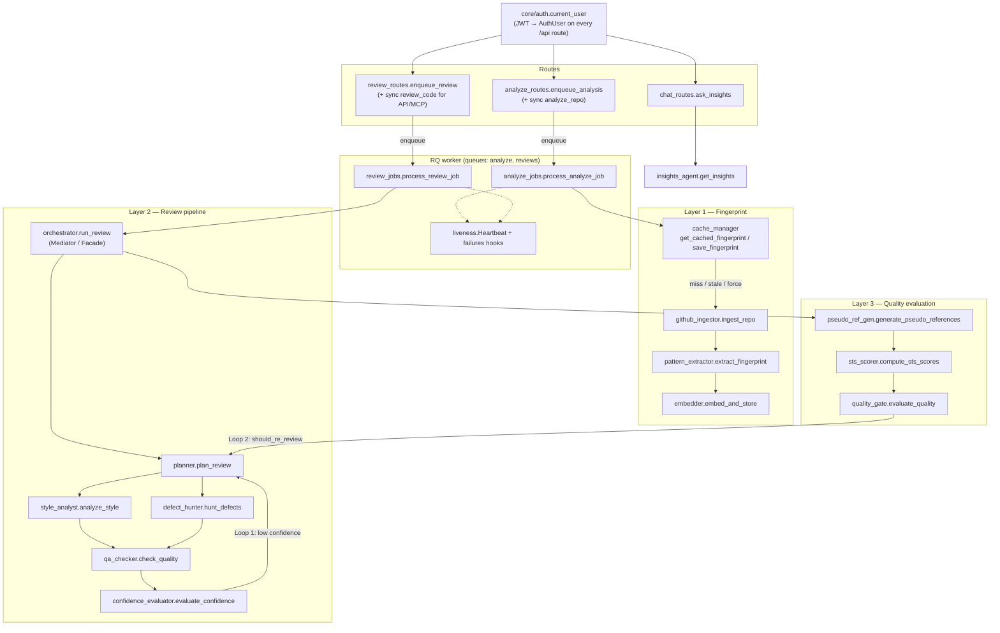

# PersonaCR — Architecture

Documentation of structural design patterns already present in the codebase. This describes how the system is organized — not measured product outcomes. Personalization effectiveness is under active measurement and is not claimed here. The [README](../README.md) has the system, sequence and data-model diagrams; this file focuses on the patterns in code.

---

## Component overview

---

## Design patterns in code

### Mediator / Facade — Orchestrator

`backend/src/agents/orchestrator.py` (`run_review`, `review_code_sync`) is the single coordination surface for a review: it sequences agents, runs Style Analyst and Defect Hunter via `asyncio.gather`, builds `ReviewResult`, and owns both agentic loops. Callers (`workers/review_jobs.process_review_job` for the UI's reviews, `review_routes.review_code` for synchronous API/MCP calls) do not wire agents directly.

### Strategy — Per-agent modules

Each review agent is an interchangeable strategy behind a narrow entry function and typed output from `backend/src/core/models.py`:

| Strategy | Module | Entry |
|----------|--------|--------|
| Plan focus / depth | `planner.py` | `plan_review` → `PlannerOutput` |
| Style vs fingerprint | `style_analyst.py` | `analyze_style` → `StyleAnalysisOutput` |
| Bugs / smells / security | `defect_hunter.py` | `hunt_defects` → `DefectHunterOutput` |
| Filter findings | `qa_checker.py` | `check_quality` → `QACheckerOutput` |
| Score confidence | `confidence_evaluator.py` | `evaluate_confidence` → `ConfidenceOutput` |

`insights_agent.get_insights` is a separate conversational strategy invoked from `chat_routes`, not from the review pipeline.

### Adapter — one LLM client

Every LLM-backed agent (planner slow path, style analyst, defect hunter, QA checker, pseudo-reference generator, insights) calls `backend/src/core/llm_client.complete(system, user, temperature, max_tokens)`. `LLM_PROVIDER` selects Anthropic (default; official SDK) or Groq; `LLM_MODEL` defaults to Claude Haiku 4.5 (`claude-haiku-4-5-20251001`) for testing, and deployments set Claude Sonnet 5.5 (`claude-sonnet-5-5`). Each call logs input/output tokens. Failures raise `LLMError`; `llm_client.track()` records them per review, and the orchestrator then marks the review `degraded` or `error` (no score, not confident) instead of scoring it.

### Chain of Responsibility / Pipeline — Layer 2 (+ Layer 3)

The review path is a fixed pipeline in `run_review`:

1. `plan_review`
2. `analyze_style` ‖ `hunt_defects` (parallel)
3. `check_quality` → `evaluate_confidence`
4. Layer 3: `generate_pseudo_references` → `compute_sts_scores` → `evaluate_quality`

Each stage consumes the prior stage’s outputs (or shared inputs like `code` / `fingerprint`) and hands off along the chain. API docs in `review_routes` describe this as the multi-agent review pipeline.

### Observer — Metrics / traces

During `run_review`, every stage appends an `AgentTrace` (`backend/src/core/models.py`) into a `traces` list — agent name, input/output summaries, decision text, `execution_time_ms`, and iteration. That list is returned on `ReviewResult.agent_trace` without agents needing to know about the UI timeline or the dashboard that consume it. Prometheus counters/histograms (`core/metrics.py`) are recorded the same way, from the orchestrator.

### Cache-Aside — SHA-based fingerprint cache

`backend/src/core/cache_manager.py` implements cache-aside for fingerprints:

- `core/analysis.run_analysis` (called by the analyze worker job, or by the synchronous `analyze_repo` route) calls `get_cached_fingerprint` first; reviews load the cached fingerprint the same way.
- On a fresh hit (cached `last_commit_sha` matches GitHub HEAD via `_get_latest_sha`), analysis is skipped and the stored `fingerprint_data` is used.
- On miss / stale / `force_refresh`, it runs `ingest_repo` → `extract_fingerprint` → `embed_and_store` (built into a temporary collection, swapped in only on success) → repo summary, then `save_fingerprint` upserts Supabase with the new SHA (account users only; guests keep the fingerprint in their Redis analysis record).

### Feedback / Retry — Two agentic loops

Both loops live in `orchestrator.run_review` (default `max_iterations=2`):

| Loop | Trigger | Behavior |
|------|---------|----------|
| **Loop 1 — Confidence** | `ConfidenceOutput.is_confident` is false and iterations remain | Re-plans with the evaluator's feedback (`_confidence_feedback`, `_previous_focus`); retries only if the new plan's focus or depth differs, and then re-runs only plan-dependent agents (Style, QA — Defect Hunter's output is reused). Any LLM failure stops both loops |
| **Loop 2 — Quality gate** | After Layer 3, `QualityGateResult.should_re_review` and iterations remain | Re-runs Layer 2 with `_quality_feedback` / `_previous_focus` on an enriched fingerprint dict, then re-evaluates Layer 3 |

Loop 1 is driven by `confidence_evaluator.evaluate_confidence`; Loop 2 by `evaluation.quality_gate.evaluate_quality`.

---

## Supporting modules (not pattern foci)

| Concern | Primary modules |
|---------|-----------------|
| Fingerprint schema | `core/models.py` → `FingerprintData` |
| Ingestion | `core/github_ingestor.py` |
| Embeddings / retrieval | `core/embedder.py` (`query_similar_staged` used by Style Analyst) |
| Persistence | `db/supabase_rest.py` |
| HTTP entry | `routes/analyze_routes.py`, `review_routes.py`, `chat_routes.py` |
| Auth | `core/auth.py` (Supabase JWT via JWKS → `AuthUser`; guests `guest_`), applied to every `/api` router in `main.py`; RLS in `migrations/007`–`010` |
| Async jobs via Redis/RQ | `core/review_queue.py` / `core/analyze_queue.py` (enqueue with an `on_failure` callback), `core/job_store.py` + `core/analysis_store.py` (status records, owner-scoped), `workers/worker.py` (one RQ worker on `reviews` + `analyze`; k8s `worker` Deployment / Compose `worker` profile) |
| Job liveness | `core/liveness.py` (15 s heartbeat; running with no heartbeat for 120 s → failed on read), `workers/failures.py` (RQ `on_failure` + `work_horse_killed_handler`) |
| Prometheus metrics export + Grafana dashboard for operator observability | `GET /metrics` (`core/metrics.py`), `observability/` + compose Prometheus/Grafana (dev/portfolio scale) |

---

## Honesty note

This document names structure only. It does not assert that fingerprint-conditioned review outperforms a generic baseline; that thesis remains unproven / under measurement in the eval suite (inconclusive at N=14).

**Positioning (mechanism, not category novelty):** Convention-aware multi-agent review is an active area. PersonaCR’s distinctive angle is the cold-start ~30-feature AST style fingerprint (no review history or config files required) feeding the review pipeline — not a claim that no prior work combines style learning with multi-agent review. See README “Approach & positioning” and `research/RELATED_WORK.md`.
